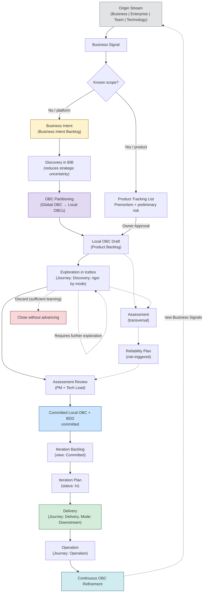

# Framework Flow

The official ProdOps Framework flow describes the path every change takes from its origin to continuous operation.

```
Origin Stream → Business Signal → [Global Flow or Local Flow] → Local OBC Draft (Product Backlog) → Exploration + Assessment → Assessment Review → Committed Local OBC + BDD committed → Iteration Backlog (VIEW) → Iteration Plan → Delivery → Operation → Continuous OBC Refinement
```

This document is the canonical reference for understanding **what happens at each step**, **what is produced**, and **when to advance**.

→ [Origin Streams: the four possible origins](origin-streams.en.md)
→ [Operating model: Framework hierarchy](operating-model.en.md)
→ [Glossary: canonical definitions](glossary.en.md)

---

## Full diagram



---

## Flow steps

### 1. Origin Stream

**Objective:** Classify the origin of the change to establish the correct context.

**What happens:** A contributor, stakeholder, or process identifies a need. The need is classified into one of the four Origin Streams: Business, Enterprise, Team, or Technology.

**What is produced:** The raw need, not yet formalized as a Business Signal.

**When to advance:** As soon as the origin is clear and Business Signal registration can begin.

→ [Definition of each Origin Stream](origin-streams.en.md)

---

### 2. Business Signal + Business Intent

**Objective:** Capture the need as a Business Signal and, if accepted strategically, formalize it as a Business Intent.

**What happens:**
- **Business Signal:** the raw need is registered as a Business Signal. Documents: the opportunity or problem identified, its origin, initial hypotheses. No implementation commitment. No OBC.
- **Business Intent:** the strategic decision to pursue value. Born when the Portfolio (Global Flow) or the Product Owner (Local Flow) accepts the Business Signal. The Business Intent documents the value to generate, context, open questions, and suggested execution mode.

**What is produced:**
- Business Signal Issue (GitHub: Portfolio GitHub Project)
- Business Intent document in `prodops/artifacts/business/intents/<slug>.md`
- Declared Origin Stream
- Listed hypotheses and open questions
- Suggested execution mode (Upstream or Downstream)

**When to advance:** As soon as the Business Intent is registered and its scope allows one path to be selected: Global when the responsible product is not known, or Local when the destination is already known.

→ [Business Intent template](../templates/business-intents/intent.en.md)

---

### 3. Global OBC Draft (BIB)

This step belongs only to the **Global Flow**. In the **Local Flow**, the Business Signal follows Product Tracking List → Premortem + Preliminary Risk Analysis → Owner Approval and creates the Local OBC Draft directly in the Product Backlog. Both paths converge in the Product Backlog.

**Objective:** Create the strategic business contract that represents the Business Intent before product-level decomposition.

**What happens:** The Business Intent enters the Business Intent Backlog. A **Global OBC Draft** is born — it captures the business goal, value, stakeholders, rules, and initial hypotheses. The Global OBC exists **before** Discovery, **before** partitioning, **before** any product commitment.

**What is produced:**
- Global OBC Draft in the BIB (lives in the portfolio repository when committed)
- Permanent identifier for the Business Intent

**When to advance:** Global OBC Draft created and Discovery in BIB initiated.

→ [Full OBC definition](obc.en.md)

---

### 4. Discovery (Journey)

**Objective:** An ACTIVITY — not a backlog. Reduce uncertainty about the business intention before partitioning.

**What happens:** The Discovery journey explores the Business Intent at the platform level. Experiments, benchmarks, spikes, research, interviews, prototypes, and premortems may be conducted. All learnings return to the Global OBC.

**What is produced:**
- Experiments in `prodops/journeys/discovery/experiments/<NNN-slug>/`
- Decision Package (hypothesis answered, clear recommendation, learnings)
- Refined Global OBC (state: Refining)
- Understanding of involved products and bounded contexts

**Upstream vs Downstream:** In the BIB, Portfolio selects the global exploration mode. After convergence in the Product Backlog, the Product Owner selects the local mode. Mode never changes the stage: an item in Discovery can change mode without changing phase.

**When to advance:** When the central hypothesis has been answered and the remaining uncertainty is acceptable for partitioning.

→ [Discovery Journey](../journeys/discovery/README.en.md)

---

### 5. OBC Partitioning

**Objective:** Transform the Global OBC into Local OBCs — one per product involved.

**What happens:** Portfolio PM and Tech Leads of the products identify each product's responsibilities, the involved repositories, and the bounded contexts. The Global OBC is decomposed into specialized Local OBCs. Each Local OBC references the Global OBC and contains only the contract for that product's responsibility.

**What is produced:**
- Local OBC Draft for each product (at `prodops/artifacts/business/obcs/<slug>.md`)
- Updated traceability table in the Global OBC
- Items created in the Product Backlogs of the involved products

**When to advance:** Each product has received its Local OBC and has begun refinement in the Icebox.

→ [OBC Partitioning](obc.en.md#obc-partitioning)

---

### 6. Exploration (in Icebox)

**Objective:** Transform the Local OBC Draft into a verifiable contract ready for delivery.

**What happens:** The Discovery journey continues at the product level — now in the Icebox. The Local OBC is refined with acceptance criteria, observable events, reliability rules, and response contract. In Upstream there is no delivery commitment and maturity may vary; in Downstream all current gates apply.

**What is produced:**
- Refined Local OBC (state: Refining → Committed)
- BDD Feature draft
- Risk and opportunity updates

**When to advance:** When the expected behavior is sufficiently understood and the remaining uncertainty is acceptable to enter Downstream. The decision to advance is explicit (PM + Tech Lead — Assessment Review).

→ [Discovery Journey](../journeys/discovery/README.en.md)

---

### 7. Committed Local OBC + BDD

**Objective:** Transform the validated knowledge into an observable and verifiable contract — ready for Delivery.

**What happens:** The Local OBC Draft is refined through Exploration (Discovery in the Icebox) and Assessment. In the Assessment Review, PM and Tech Lead review the full set; when approved, the Local OBC reaches the Committed state and the BDD Feature is promoted to the committed directories. Without this set, there is no Downstream execution.

**What is produced:**
- Local OBC committed in `prodops/artifacts/business/obcs/<slug>.md`
- BDD Feature committed in `prodops/artifacts/business/bdd/<slug>.feature`

**When to advance:** Local OBC committed, BDD Feature committed, both reviewed and approved.

→ [Full OBC definition](obc.en.md)
→ [OBC artifacts](../artifacts/business/obcs/)

---

### 8. Reliability Plan

**Objective:** Define, through the transversal Assessment journey, the reliability conditions required before commitment in the Iteration Plan.

**What happens:** Identified risks are transformed into a reliability plan. SLOs, mitigation actions, rollback criteria, and failure points are explicitly documented. Assessment runs in parallel with other journeys.

**What is produced:**
- Entry in the Reliability Plan in `prodops/journeys/assessment/reliability-plans/`
- Risks updated in `prodops/journeys/assessment/risks.md`

**When to advance:** Reliability Plan updated and Assessment Review completed for the item.

→ [Reliability Plans](../journeys/assessment/reliability-plans/)

---

### 9. Iteration Plan

**Objective:** Formally commit the capability to the next delivery iteration after Assessment Review.

**What happens:** The approved set — Committed Local OBC, BDD Feature, risks, and Reliability Plan (when there is financial movement, external integration, SLO change, high/critical risk, or persistence/security change) — enters the Iteration Plan with status `In`. This represents the formal delivery commitment; it is not, in isolation, proof of readiness.

**What is produced:**
- Entry in the Iteration Plan in `prodops/artifacts/governance/plans/iteration-plan.md` with status `In`
- Product Tracking List update if the item was there

**When to advance:** All Downstream readiness gates are satisfied.

→ [Iteration Plan](../artifacts/governance/plans/iteration-plan.en.md)

---

### 10. Delivery

**Objective:** Implement the capability with traceability, verifiable acceptance criteria, and evidence recorded at each step.

**What happens:** Downstream work follows the mandatory sequence `Bootstrap → Hack → Sync → Finish → Ship → Validate → Promote`, divided into CI Sync (local work) and CI Async (platform and pipelines). The Local OBC transitions to the In Delivery state.

**What is produced:**
- Delivered and promoted software
- Updated Release Trail
- Recorded evidence
- Local OBC in In Delivery state

**When to advance:** Promote completed, Release Trail updated, OBC validated in production.

→ [Delivery Journey](../journeys/delivery/README.en.md)
→ [Execution Mode Downstream](../execution-model/downstream.en.md)

---

### 11. Operation + Continuous Refinement

**Objective:** Continuously operate and monitor the delivered software, maintaining OBC criteria and continuously refining the contract with operational evidence.

**What happens:** Runbooks, SLO monitoring, alerts, incident response, postmortems, operational trail updates. Operation feeds Continuous OBC Refinement — every new operational piece of evidence updates the contract (Global and Local). Operation generates new Business Signals.

**What is produced:**
- Local OBC in Operational state (updated with evidence)
- Global OBC in Operational state (updated with consolidated evidence)
- Updated Operational Trail
- Documented incidents
- Postmortems when relevant
- New Business Signals (via Continuous Assessment)

**When to advance:** Operation is continuous — it has no defined end point. The cycle restarts with new Business Signals generated by operational learning.

→ [Operation Journey](../journeys/operation/)

---

## Naming notes

**Upstream and Downstream are modes, not phases**

Upstream and Downstream describe the **execution mode** — the commitment and rigor applied. They are not flow phases.

- **Upstream:** permissive mode; disposable code; no mandatory gates. Can start at any stage. When finished, returns to the original stage.
- **Downstream:** delivery-committed mode; all current quality gates apply.

An item can transition between modes within the same stage. The mode never determines the stage.

**Exploration vs Discovery vs Upstream**

| Term | Level | Meaning |
|---|---|---|
| **Exploration** | Flow step | What happens between Business Intent and Committed OBC: uncertainty reduction |
| **Discovery** | Journey | The name of the Framework journey that implements Exploration |
| **Upstream** | Execution Mode | The execution mode (low commitment) used during Discovery |

When describing the macro flow, use **Exploration**. When referencing the specific journey, use **Discovery**. When referencing the execution mode, use **Upstream**.

---

## References

→ [Origin Streams](origin-streams.en.md)
→ [Glossary](glossary.en.md)
→ [Business Intent Phases: Conception and Inception](phases.en.md)
→ [Operating model](operating-model.en.md)
→ [Execution Model](../execution-model/README.en.md)
→ [Journeys](../journeys/README.en.md)
