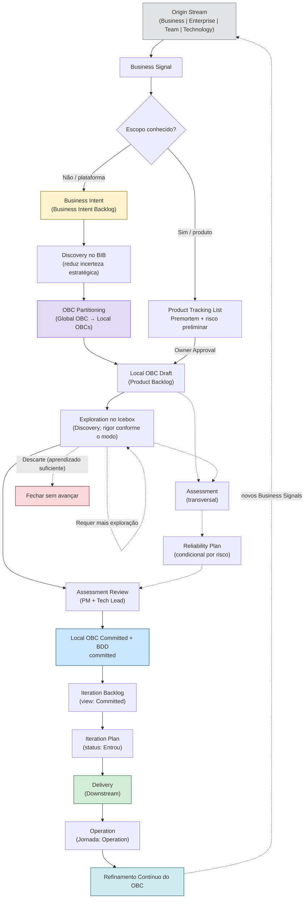

# Framework Flow

O fluxo oficial do Framework ProdOps descreve o caminho que toda mudança percorre desde a sua origem até a operação contínua.

```
Origin Stream → Business Signal → [Fluxo Global ou Fluxo Local] → Local OBC Draft (Product Backlog) → Exploration + Assessment → Assessment Review → Local OBC Committed + BDD committed → Iteration Backlog (VIEW) → Iteration Plan → Delivery → Operation → Refinamento Contínuo do OBC
```

Este documento é a referência canônica para entender **o que acontece em cada etapa**, **o que é produzido** e **quando avançar**.

→ [Origin Streams: as quatro origens possíveis](origin-streams.md)
→ [Modelo operacional: hierarquia do Framework](operating-model.md)
→ [Glossário: definições canônicas](glossary.md)

---

## Diagrama completo



---

## Etapas do fluxo

### 1. Origin Stream

**Objetivo:** Classificar a origem da mudança para estabelecer o contexto correto.

**O que acontece:** Um colaborador, stakeholder ou processo identifica uma necessidade. A necessidade é classificada em um dos quatro Origin Streams: Business, Enterprise, Team ou Technology.

**O que é produzido:** A necessidade bruta, ainda não formalizada como Business Signal.

**Quando avançar:** Assim que a origem estiver clara e o registro do Business Signal puder ser iniciado.

→ [Definição de cada Origin Stream](origin-streams.md)

---

### 2. Business Signal + Business Intent

**Objetivo:** Capturar a necessidade como Business Signal e, se aceita estrategicamente, formalizar como Business Intent.

**O que acontece:**
- **Business Signal:** a necessidade bruta é registrada como Business Signal. Documenta: a oportunidade ou problema identificado, a origem, as hipóteses iniciais. Sem compromisso de implementação. Sem OBC.
- **Business Intent:** decisão estratégica de perseguir valor. Nasce quando o Portfolio (Fluxo Global) ou o Product Owner (Fluxo Local) aceita o Business Signal. A Business Intent documenta o valor a ser gerado, o contexto, as perguntas em aberto e o modo de execução sugerido.

**O que é produzido:**
- Business Signal Issue (GitHub: Portfolio GitHub Project)
- Documento de Business Intent em `prodops/artifacts/business/intents/<slug>.md`
- Origin Stream declarado
- Hipóteses e perguntas em aberto listadas
- Sugestão de modo de execução (Upstream ou Downstream)

**Quando avançar:** Assim que a Business Intent estiver registrada e sua abrangência permitir escolher um dos caminhos: Global, quando o produto responsável ainda não está definido; ou Local, quando o destino já é conhecido.

→ [Template de Business Intent](../templates/business-intents/intent.md)

---

### 3. Global OBC Draft (BIB)

Esta etapa pertence somente ao **Fluxo Global**. No **Fluxo Local**, o Business Signal segue por Product Tracking List → Premortem + Análise de Risco Preliminar → Owner Approval e cria o Local OBC Draft diretamente no Product Backlog. Os dois caminhos convergem no Product Backlog.

**Objetivo:** Criar o contrato de negócio estratégico que representa a Business Intent antes da decomposição por produto.

**O que acontece:** A Business Intent entra no Business Intent Backlog. Um **Global OBC Draft** nasce — captura o objetivo de negócio, o valor, os stakeholders, as regras e hipóteses iniciais. O Global OBC existe **antes** do Discovery, **antes** do particionamento, **antes** de qualquer compromisso de produto.

**O que é produzido:**
- Global OBC Draft no BIB (vive no repositório de portfólio quando committed)
- Identificador permanente da Business Intent

**Quando avançar:** Global OBC Draft criado e Discovery no BIB iniciado.

→ [Definição completa do OBC](obc.md)

---

### 4. Discovery (Jornada)

**Objetivo:** É uma atividade — não um backlog. Reduzir a incerteza da intenção de negócio antes do particionamento.

**O que acontece:** A jornada Discovery explora a Business Intent no nível de plataforma. Experimentos, benchmarks, spikes, pesquisas, entrevistas, protótipos e premortems podem ser conduzidos. Todos os aprendizados retornam ao Global OBC.

**O que é produzido:**
- Experimentos em `prodops/journeys/discovery/experiments/<NNN-slug>/`
- Decision Package (hipótese respondida, recomendação clara, aprendizados)
- Global OBC refinado (estado: Refining)
- Compreensão dos produtos envolvidos e dos bounded contexts

**Upstream vs Downstream:** No BIB, o Portfolio decide o modo da exploração global. Depois da convergência no Product Backlog, o Product Owner decide o modo local. O modo nunca muda o estágio: um item em Discovery pode mudar de modo sem mudar de fase.

**Quando avançar:** Quando a hipótese central tiver sido respondida e a incerteza remanescente for aceitável para o particionamento.

→ [Jornada Discovery](../journeys/discovery/README.md)

---

### 5. OBC Partitioning

**Objetivo:** Transformar o Global OBC em Local OBCs — um por produto envolvido.

**O que acontece:** Portfolio PM e Tech Leads dos produtos identificam as responsabilidades de cada produto, os repositórios envolvidos e os bounded contexts. O Global OBC é decomposto em Local OBCs especializados. Cada Local OBC referencia o Global OBC e contém apenas o contrato de responsabilidade daquele produto.

**O que é produzido:**
- Local OBC Draft para cada produto (em `prodops/artifacts/business/obcs/<slug>.md`)
- Tabela de rastreabilidade atualizada no Global OBC
- Itens criados nos Product Backlogs dos produtos envolvidos

**Quando avançar:** Cada produto recebeu seu Local OBC e iniciou o refinamento no Icebox.

→ [OBC Partitioning](obc.md#particionamento-do-obc)

---

### 6. Exploration (no Icebox)

**Objetivo:** Transformar o Local OBC Draft em um contrato verificável e pronto para entrega.

**O que acontece:** A jornada Discovery continua no nível de produto — agora no Icebox. O Local OBC é refinado com critérios de aceite, eventos observáveis, regras de confiabilidade e contrato de resposta. Em Upstream não há compromisso de entrega e a maturidade pode variar; em Downstream aplicam-se todos os gates vigentes.

**O que é produzido:**
- Local OBC refinado (estado: Refining → Committed)
- BDD Feature draft
- Atualização de riscos e oportunidades

**Quando avançar:** Quando o comportamento esperado estiver suficientemente compreendido e a incerteza remanescente for aceitável para entrar em Downstream. A decisão de avançar é explícita (PM + Tech Lead — Assessment Review).

→ [Jornada Discovery](../journeys/discovery/README.md)

---

### 7. Local OBC Committed + BDD

**Objetivo:** Transformar o conhecimento validado em um contrato observável e verificável — pronto para Delivery.

**O que acontece:** O Local OBC Draft é refinado pela Exploration (Discovery no Icebox) e pela Assessment. Na Assessment Review, PM e Tech Lead revisam o conjunto; quando aprovado, o Local OBC atinge o estado Committed e a BDD Feature é promovida para os diretórios committed. Sem esse conjunto, não há execução Downstream.

**O que é produzido:**
- Local OBC committed em `prodops/artifacts/business/obcs/<slug>.md`
- BDD Feature committed em `prodops/artifacts/business/bdd/<slug>.feature`

**Quando avançar:** Local OBC committed, BDD Feature committed, ambos revisados e aprovados.

→ [Definição completa do OBC](obc.md)
→ [Artefatos OBC](../artifacts/business/obcs/)

---

### 8. Reliability Plan

**Objetivo:** Definir, pela jornada transversal de Assessment, as condições de confiabilidade necessárias antes do compromisso no Iteration Plan.

**O que acontece:** Os riscos identificados são transformados em um plano de confiabilidade. SLOs, ações de mitigação, critérios de rollback e pontos de falha são documentados explicitamente. Assessment corre em paralelo às demais jornadas.

**O que é produzido:**
- Entrada no Reliability Plan em `prodops/journeys/assessment/reliability-plans/`
- Riscos atualizados em `prodops/journeys/assessment/risks.md`

**Quando avançar:** Reliability Plan atualizado e Assessment Review concluída para o item.

→ [Reliability Plans](../journeys/assessment/reliability-plans/)

---

### 9. Iteration Plan

**Objetivo:** Comprometer formalmente a capability na próxima iteração de entrega depois da Assessment Review.

**O que acontece:** O conjunto aprovado — Local OBC Committed, BDD Feature, riscos e Reliability Plan (quando houver movimentação financeira, integração externa, mudança de SLO, risco alto/crítico ou alteração de persistência ou segurança) — entra no Iteration Plan com status `Entrou`. Isso representa compromisso formal de entrega; não é, isoladamente, prova de readiness.

**O que é produzido:**
- Entrada no Iteration Plan em `prodops/artifacts/governance/plans/iteration-plan.md` com status `Entrou`
- Atualização da Product Tracking List se o item estava lá

**Quando avançar:** Todos os gates de readiness Downstream estão satisfeitos.

→ [Iteration Plan](../artifacts/governance/plans/iteration-plan.md)

---

### 10. Delivery

**Objetivo:** Implementar a capability com rastreabilidade, critérios de aceite verificáveis e evidência registrada em cada etapa.

**O que acontece:** O trabalho Downstream segue a sequência obrigatória `Bootstrap → Hack → Sync → Finish → Ship → Validate → Promote`, dividida em CI Sync (trabalho local) e CI Async (plataforma e pipelines). O Local OBC muda para o estado In Delivery.

**O que é produzido:**
- Software entregue e promovido
- Release Trail atualizado
- Evidências registradas
- Local OBC no estado In Delivery

**Quando avançar:** Promote concluído, Release Trail atualizado, OBC validado em produção.

→ [Jornada Delivery](../journeys/delivery/README.md)
→ [Execution Mode Downstream](../execution-model/downstream.md)

---

### 11. Operation + Refinamento Contínuo

**Objetivo:** Operar e monitorar continuamente o software entregue, mantendo os critérios do OBC e refinando-o continuamente com evidências operacionais.

**O que acontece:** Runbooks, monitoramento de SLOs, alertas, resposta a incidentes, postmortems, atualizações de operational trail. A operação alimenta o Refinamento Contínuo do OBC — toda nova evidência operacional atualiza o contrato (Global e Local). A operação gera novos Business Signals.

**O que é produzido:**
- Local OBC no estado Operational (atualizado com evidências)
- Global OBC no estado Operational (atualizado com evidências consolidadas)
- Operational Trail atualizado
- Incidentes documentados
- Postmortems quando relevante
- Novos Business Signals (via Continuous Assessment)

**Quando avançar:** Operação é contínua — não tem ponto de encerramento definido. O ciclo recomeça com novos Business Signals gerados pelo aprendizado operacional.

→ [Jornada Operation](../journeys/operation/)

---

## Notas de nomenclatura

**Upstream e Downstream são modos, não fases**

Upstream e Downstream descrevem o **modo de execução** — o compromisso e o rigor aplicados. Não são fases do fluxo.

- **Upstream:** modo permissivo; código descartável; sem gates obrigatórios. Pode iniciar em qualquer estágio. Quando concluído, retorna ao estágio original.
- **Downstream:** modo com compromisso de entrega; aplica todos os quality gates vigentes.

Um item pode transicionar entre modos ao longo do mesmo estágio. O modo nunca determina o estágio.

**Exploration vs Discovery vs Upstream**

| Termo | Nível | Significado |
|---|---|---|
| **Exploration** | Etapa do fluxo | O que acontece entre Business Intent e OBC Committed: redução de incerteza |
| **Discovery** | Jornada | O nome da jornada do Framework que implementa Exploration |
| **Upstream** | Execution Mode | O modo permissivo e sem compromisso que pode modular qualquer jornada |

Ao descrever o fluxo macro, use **Exploration**. Ao referenciar a jornada específica, use **Discovery**. Ao referenciar o modo de execução, use **Upstream**.

---

## Referências

→ [Origin Streams](origin-streams.md)
→ [Glossário](glossary.md)
→ [Fases da Business Intent: Concepção e Inception](phases.md)
→ [Modelo operacional](operating-model.md)
→ [Execution Model](../execution-model/README.md)
→ [Jornadas](../journeys/README.md)
