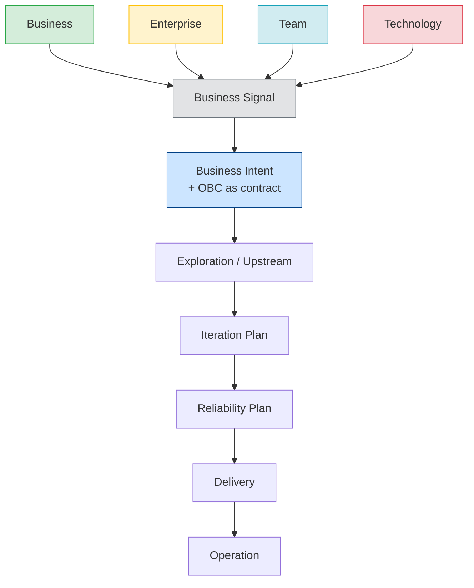

# Origin Streams

An **Origin Stream** identifies the origin of a **Business Signal** in the ProdOps Framework.

Every change starts with a Business Signal. The Business Signal always has exactly one Origin Stream — the classification of where the need was born and who owns it. The Origin Stream does not determine how the work will be executed (that is the function of the Execution Mode), but it informs the context, the language, and the success criteria that the Business Signal carries. When investigated and recognized as strategic, a Business Signal can generate one or more Business Intents (1:N relationship).

A Business Intent can also be created directly in the Business Intent Backlog, without originating from a Business Signal.

→ [Full Framework flow](flow.en.md)
→ [Operating model](operating-model.en.md)
→ [Glossary](glossary.en.md)

---

## Diagram

---

## The four Origin Streams

### Business

**Definition:** Needs generated by the market, the customer, or product growth opportunities.

**Purpose:** Increase the value delivered to the market — new products, new services, new channels, monetization, ICP expansion, acquisition, retention, churn reduction.

**When to use:** The need has a direct relationship with market outcome (revenue, customer base, customer satisfaction, conversion, adoption).

**When not to use:** The need is internal (compliance, governance), operational (team process), or purely technical (infrastructure, security). Those belong to Enterprise, Team, or Technology, respectively.

**Examples:**
- Support for multiple payments at checkout (Pix + Card) to increase conversion
- New Pix payment channel to reduce checkout abandonment
- Boleto issuance with automatic split for marketplaces
- Payment confirmation webhook for partner integrations
- Subscription recurrence support to reduce customer churn

**Counter-examples (not Business):**
- Migrate database from SQL to DynamoDB → Technology
- Implement log retention policy for auditing → Enterprise
- Adopt Conventional Commits in the repository → Team

**Generated artifacts:**
- Business Signal with `origin_stream: Business`
- Business hypotheses to validate
- Open questions about the value to generate

**How it evolves to OBC:**
A Business Signal with Business Origin Stream generates a Business Intent when investigated and recognized as strategic. The Business Intent enters Exploration with questions about business value, user experience, and technical feasibility. The resulting OBC defines observable product success criteria — typically expressed as verifiable behavior via BDD Feature.

---

### Enterprise

**Definition:** Internal organizational needs that do not directly generate market value, but are mandatory for legal, regulatory, contractual, or corporate governance reasons.

**Purpose:** Ensure compliance, reduce corporate risks, meet audit requirements, partner or legislation requirements, integrate internal systems (ERP, financial, backoffice), reduce operational costs.

**When to use:** The need is imposed from outside the product (law, regulation, corporate policy, contractual agreement) or resolves an internal operational scale problem.

**When not to use:** The need is a product evolution for the market (Business), engineering process improvement (Team), or technical platform evolution (Technology).

**Examples:**
- Implement transaction report for quarterly accounting audit
- Adapt the API to the Central Bank regulation on Open Finance
- Integrate the payments module with the corporate financial ERP
- Implement data retention per LGPD
- Emit SBOM for dependency traceability in compliance with security policy

**Counter-examples (not Enterprise):**
- Add Pix support for new customers → Business
- Refactor the CI pipeline to reduce build time → Team
- Migrate to Kubernetes to improve scalability → Technology

**Generated artifacts:**
- Business Signal with `origin_stream: Enterprise`
- Reference to the external requirement (law, policy, contract)
- Compliance criteria to satisfy

**How it evolves to OBC:**
A Business Signal with Enterprise Origin Stream generates a Business Intent when investigated. Enterprise Business Intents often have more objective criteria (the law says X, the contract requires Y). The OBC defines the observable behavior that demonstrates compliance — auditable, traceable, verifiable.

---

### Team

**Definition:** Needs generated by the product and engineering team itself to evolve the way of working, processes, tools, and operational quality.

**Purpose:** Improve productivity, quality, onboarding, workflow, automations, process traceability, engineer experience.

**When to use:** The need is internal to the team's process — how the team works, not what the team delivers to the market.

**When not to use:** The benefit is for the customer or market (Business), to meet a corporate requirement (Enterprise), or to evolve the technical platform (Technology).

**Examples:**
- Adopt Conventional Commits and validation hooks in the repository
- Create automated Bootstrap skill to reduce manual setup
- Document the Commit Workflow for onboarding of new engineers
- Implement Validation Workbench to accelerate local experiments
- Create Decision Trail template to standardize architecture decisions

**Counter-examples (not Team):**
- Add SLO monitoring for the customer to see on a dashboard → Business
- Implement disaster recovery policy per partner requirement → Enterprise
- Migrate infrastructure to reduce product latency → Technology

**Generated artifacts:**
- Business Signal with `origin_stream: Team`
- Description of the current process problem
- Observable improvement criteria

**How it evolves to OBC:**
A Business Signal with Team Origin Stream generates a Business Intent when investigated. The Business Intent evolves to an OBC that describes the expected behavior of the new process or tool — verifiable in the team's practice (e.g.: hook executes in less than 2s, template generates a valid artifact, skill completes without error).

---

### Technology

**Definition:** Needs generated by the evolution of the platform's technical capabilities, security, infrastructure, and system reliability.

**Purpose:** Evolve architecture, security, infrastructure, observability, reliability, cloud platform, database, container orchestration, serverless, IAM, cryptography, reduction of technical debt.

**When to use:** The need is technical and the primary benefit is for the system — better scalability, lower infrastructure latency, greater security, lower cloud cost.

**When not to use:** The technical improvement is a direct consequence of a product requirement (Business), a corporate requirement (Enterprise), or an internal process requirement (Team).

**Examples:**
- Migrate from relational database to DynamoDB to support horizontal scaling
- Implement automatic credential rotation via AWS Secrets Manager
- Adopt OpenTelemetry for distributed traceability
- Migrate to Kubernetes to improve resource density and rollout
- Implement encryption at rest for payment data

**Counter-examples (not Technology):**
- Add audit field to transactions per Central Bank requirement → Enterprise
- Create automated deploy skill for the team → Team
- Implement new payment method to increase conversion → Business

**Generated artifacts:**
- Business Signal with `origin_stream: Technology`
- Technical diagnosis of the current situation
- Observable improvement criteria (latency, availability, security coverage)

**How it evolves to OBC:**
A Business Signal with Technology Origin Stream generates a Business Intent when investigated and recognized as strategic. The Business Intent evolves to an OBC with measurable technical criteria — SLOs, security metrics, performance benchmarks, error rate reduction.

---

## Classification rules

**A Business Signal has exactly one Origin Stream.** If it seems to belong to two, choose the one that describes the **primary beneficiary of the change**:

| Who primarily benefits | Origin Stream |
|---|---|
| Customer / Market / Product | Business |
| Organization / Compliance / Partners | Enterprise |
| Engineering team / Process | Team |
| System / Platform / Infrastructure | Technology |

**Real hybrid Business Signals exist.** When a change serves two purposes (e.g.: migrating to Kubernetes reduces cost AND improves product scalability), register by the primary objective. If both are equally important, prefer the one with greater business impact.

---

## References

→ [Full Framework flow](flow.en.md)
→ [Glossary: canonical definitions](glossary.en.md)
→ [Operating model: Origin layer at the top of the hierarchy](operating-model.en.md)
→ [Intent templates](../templates/business-intents/intent.en.md)
→ [Active Intents](../artifacts/business/intents/README.en.md)
