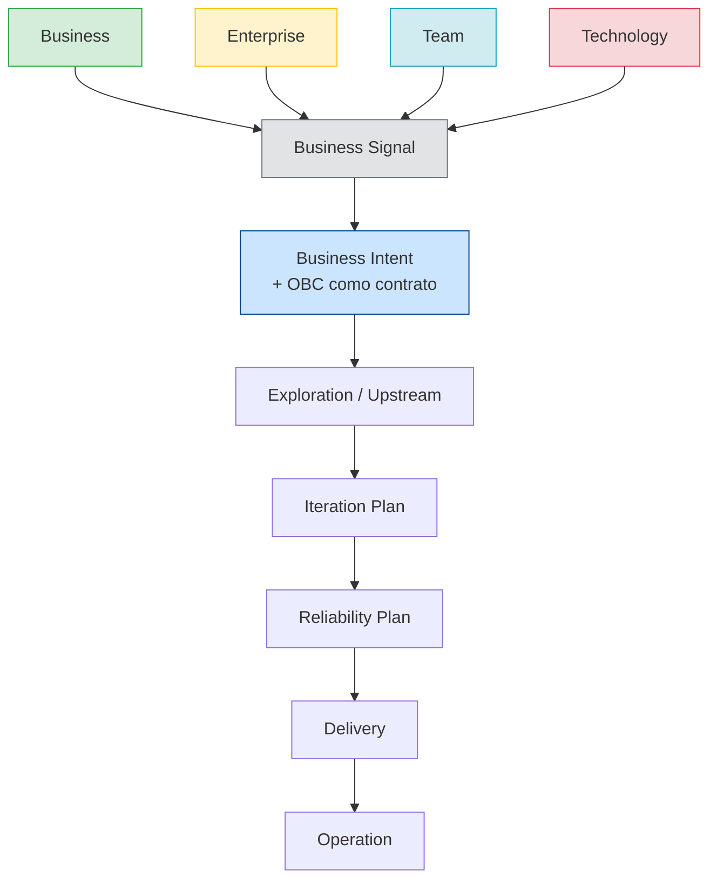

# Origin Streams

Um **Origin Stream** identifica a origem de um **Business Signal** no Framework ProdOps.

Toda mudança começa com um Business Signal. O Business Signal tem sempre exatamente um Origin Stream — a classificação de onde a necessidade nasceu e quem a detém. O Origin Stream não determina como o trabalho será executado (isso é função do Execution Mode), mas informa o contexto, a linguagem e os critérios de sucesso que o Business Signal carrega. Quando investigado e reconhecido como estratégico, o Business Signal pode gerar uma ou mais Business Intents (relação 1:N).

Uma Business Intent também pode ser criada diretamente no Business Intent Backlog, sem origem em um Business Signal.

→ [Fluxo completo do Framework](flow.md)
→ [Modelo operacional](operating-model.md)
→ [Glossário](glossary.md)

---

## Diagrama

---

## Os quatro Origin Streams

### Business

**Definição:** Necessidades geradas pelo mercado, pelo cliente ou pelas oportunidades de crescimento do produto.

**Propósito:** Aumentar o valor entregue ao mercado — novos produtos, novos serviços, novos canais, monetização, expansão de ICP, aquisição, retenção, redução de churn.

**Quando usar:** A necessidade tem relação direta com resultado de mercado (receita, base de clientes, satisfação do cliente, conversão, adoção).

**Quando não usar:** A necessidade é interna (compliance, governança), operacional (processo de time) ou puramente técnica (infraestrutura, segurança). Esses pertencem a Enterprise, Team ou Technology, respectivamente.

**Exemplos:**
- Suporte a múltiplos pagamentos no checkout (Pix + Cartão) para aumentar conversão
- Novo canal de pagamento via Pix para reduzir abandono do checkout
- Emissão de boleto com split automático para marketplaces
- Webhook de confirmação de pagamento para integrações de parceiros
- Suporte a recorrência de assinaturas para reduzir churn de clientes

**Contraexemplos (não são Business):**
- Migrar banco de dados de SQL para DynamoDB → Technology
- Implementar política de retenção de logs para auditoria → Enterprise
- Adotar Conventional Commits no repositório → Team

**Artefatos gerados:**
- Business Signal com `origin_stream: Business`
- Hipóteses de negócio a validar
- Perguntas abertas sobre o valor a gerar

**Como evolui para OBC:**
O Business Signal Business gera uma Business Intent quando investigado e reconhecido como estratégico. A Business Intent entra em Exploration com perguntas sobre o valor de negócio, a experiência do usuário e a viabilidade técnica. O OBC resultante define critérios observáveis de sucesso do produto — normalmente expressos como comportamento verificável via BDD Feature.

---

### Enterprise

**Definição:** Necessidades internas da organização que não são diretamente geradoras de valor de mercado, mas são obrigatórias por razões legais, regulatórias, contratuais ou de governança corporativa.

**Propósito:** Garantir conformidade, reduzir riscos corporativos, atender exigências de auditoria, parceiros ou legislação, integrar sistemas internos (ERP, financeiro, backoffice), reduzir custos operacionais.

**Quando usar:** A necessidade é imposta por fora do produto (lei, regulação, política corporativa, acordo contratual) ou resolve um problema interno de escala operacional.

**Quando não usar:** A necessidade é uma evolução do produto para o mercado (Business), melhoria do processo de engenharia (Team) ou evolução técnica de plataforma (Technology).

**Exemplos:**
- Implementar relatório de transações para auditoria contábil trimestral
- Adequar a API à regulação do Banco Central sobre Open Finance
- Integrar o módulo de pagamentos ao ERP financeiro corporativo
- Implementar retenção de dados conforme LGPD
- Emitir SBOM para rastreabilidade de dependências em conformidade com política de segurança

**Contraexemplos (não são Enterprise):**
- Adicionar suporte a Pix para novos clientes → Business
- Refatorar o pipeline de CI para reduzir tempo de build → Team
- Migrar para Kubernetes para melhorar escalabilidade → Technology

**Artefatos gerados:**
- Business Signal com `origin_stream: Enterprise`
- Referência ao requisito externo (lei, política, contrato)
- Critérios de conformidade a satisfazer

**Como evolui para OBC:**
O Business Signal Enterprise gera uma Business Intent quando investigado. A Business Intent frequentemente tem critérios mais objetivos (a lei diz X, o contrato exige Y). O OBC define o comportamento observável que demonstra conformidade — auditável, rastreável, verificável.

---

### Team

**Definição:** Necessidades geradas pelo próprio time de produto e engenharia para evoluir a forma de trabalhar, os processos, as ferramentas e a qualidade operacional.

**Propósito:** Melhorar a produtividade, a qualidade, o onboarding, o fluxo de trabalho, as automações, a rastreabilidade de processos, a experiência do engenheiro.

**Quando usar:** A necessidade é interna ao processo do time — como o time trabalha, não o que o time entrega ao mercado.

**Quando não usar:** O benefício é para o cliente ou mercado (Business), para atender exigência corporativa (Enterprise) ou para evoluir a plataforma técnica (Technology).

**Exemplos:**
- Adotar Conventional Commits e hooks de validação no repositório
- Criar skill de Bootstrap automatizado para reduzir setup manual
- Documentar o Commit Workflow para onboarding de novos engenheiros
- Implementar Validation Workbench para acelerar experimentos locais
- Criar template de Decision Trail para padronizar decisões de arquitetura

**Contraexemplos (não são Team):**
- Adicionar monitoramento de SLOs para o cliente ver no dashboard → Business
- Implementar política de disaster recovery por requisito do parceiro → Enterprise
- Migrar infraestrutura para reduzir latência do produto → Technology

**Artefatos gerados:**
- Business Signal com `origin_stream: Team`
- Descrição do problema de processo atual
- Critérios de melhoria observáveis

**Como evolui para OBC:**
O Business Signal Team gera uma Business Intent quando investigado. A Business Intent evolui para um OBC que descreve o comportamento esperado do novo processo ou ferramenta — verificável na prática do time (ex.: hook executa em menos de 2s, template gera artefato válido, skill conclui sem erro).

---

### Technology

**Definição:** Necessidades geradas pela evolução das capacidades técnicas da plataforma, da segurança, da infraestrutura e da confiabilidade do sistema.

**Propósito:** Evoluir arquitetura, segurança, infraestrutura, observabilidade, confiabilidade, plataforma de cloud, banco de dados, orquestração de containers, serverless, IAM, criptografia, redução de débito técnico.

**Quando usar:** A necessidade é técnica e o benefício primário é para o sistema — melhor escalabilidade, menor latência de infraestrutura, maior segurança, menor custo de cloud.

**Quando não usar:** A melhoria técnica é consequência direta de um requisito de produto (Business), de uma exigência corporativa (Enterprise) ou de um processo interno (Team).

**Exemplos:**
- Migrar de banco relacional para DynamoDB para suportar escala horizontal
- Implementar rotação automática de credenciais via AWS Secrets Manager
- Adotar OpenTelemetry para rastreabilidade distribuída
- Migrar para Kubernetes para melhorar densidade de recursos e rollout
- Implementar criptografia em repouso para dados de pagamento

**Contraexemplos (não são Technology):**
- Adicionar campo de auditoria em transactions por requisito do Banco Central → Enterprise
- Criar skill de deploy automatizado para o time → Team
- Implementar novo método de pagamento para aumentar conversão → Business

**Artefatos gerados:**
- Business Signal com `origin_stream: Technology`
- Diagnóstico técnico da situação atual
- Critérios observáveis de melhoria (latência, disponibilidade, cobertura de segurança)

**Como evolui para OBC:**
O Business Signal Technology gera uma Business Intent quando investigado e reconhecido como estratégico. A Business Intent evolui para um OBC com critérios técnicos mensuráveis — SLOs, métricas de segurança, benchmarks de performance, redução de error rate.

---

## Regras de classificação

**Um Business Signal tem exatamente um Origin Stream.** Se parecer que pertence a dois, escolha o que descreve o **beneficiário primário da mudança**:

| Quem se beneficia primariamente | Origin Stream |
|---|---|
| Cliente / Mercado / Produto | Business |
| Organização / Compliance / Parceiros | Enterprise |
| Time de engenharia / Processo | Team |
| Sistema / Plataforma / Infraestrutura | Technology |

**Business Signals híbridos reais existem.** Quando uma mudança serve a dois propósitos (ex.: migrar para Kubernetes reduz custo E melhora escalabilidade do produto), registre pelo objetivo primário. Se ambos forem igualmente importantes, prefira o que tem maior impacto de negócio.

---

## Referências

→ [Fluxo completo do Framework](flow.md)
→ [Glossário: definições canônicas](glossary.md)
→ [Modelo operacional: camada Origin no topo da hierarquia](operating-model.md)
→ [Templates de Intent](../templates/business-intents/intent.md)
→ [Intents ativas](../artifacts/business/intents/README.md)
