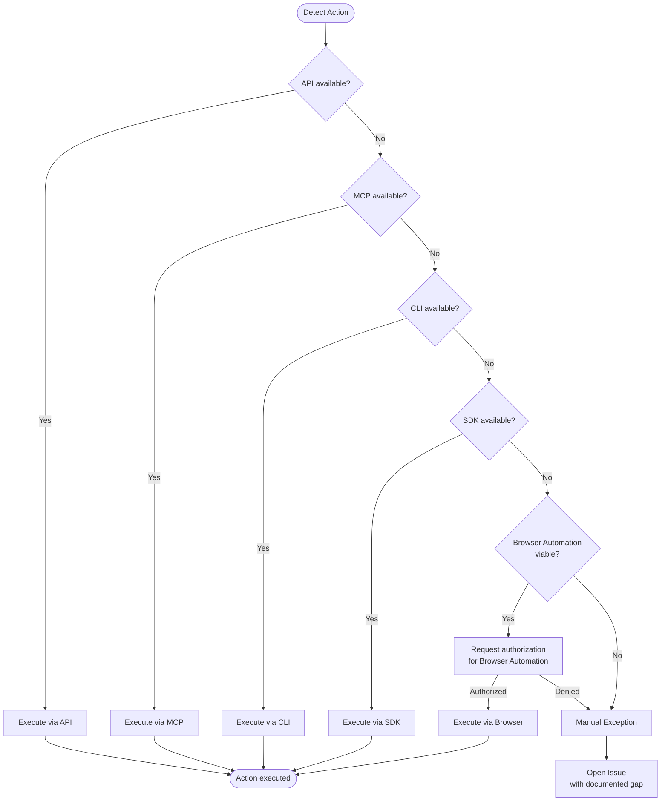

# Automation First

**Principle 11 of the ProdOps Framework.**

---

## Definition

An agent must always attempt to execute an action itself before instructing a human to do it. Manual intervention is a last resort — a documented **Manual Exception** — never the default path.

---

## Philosophy

The question an agent must ask itself when facing any action is:

> **"Can I execute this?"** — not "How do I explain to the human to execute it?"

The agent is the primary executor. The human is engaged only when all automation possibilities have been demonstrably exhausted.

---

## Canonical Order of Attempts

Before declaring that an action requires human intervention, the agent goes through the following sequence in order:

| Priority | Mechanism | Condition for use |
|---|---|---|
| 1 | **API** | REST or GraphQL endpoint available for the action |
| 2 | **MCP** | MCP tool available that performs the action |
| 3 | **CLI** | Command-line tool (e.g.: `gh`, `curl`, `jq`) |
| 4 | **SDK** | SDK available in the session (e.g.: Octokit, Anthropic SDK) |
| 5 | **Browser Automation** | None of the above work; action is achievable via UI |
| — | **Manual Exception** | All options above were attempted and failed |

Each level of the sequence must be **attempted**, not merely evaluated theoretically. The agent executes and captures the error. "I don't know if it works" is not justification for skipping a level.

---

## Decision Flow



---

## Manual Exception

A **Manual Exception** is a documented operational exception: the action cannot be automated in the current context due to a demonstrable platform or environment limitation.

### When it applies

- API returns a definitive error (e.g.: 404 on an endpoint that does not support the operation, absence of mutation in GraphQL).
- No MCP tool, CLI, or SDK can perform the action.
- Browser Automation was requested and denied by the user.

### Mandatory requirements

1. **Open a tracking Issue** with:
   - Title: `infra: <description of the limitation>`
   - Labels: `operation:provision`, `journey:diligence` (or the labels relevant to the context)
   - Body: captured API error, what was attempted, resolution criteria
2. **Record in the Conformance Report** under "Known Platform Limitations".
3. **Never leave as floating text** — the instruction does not go in the agent's output; it goes in the body of the Issue.

### What is NOT a Manual Exception

- "I didn't try the API but I think it won't work."
- "The UI is faster."
- "The user can do it more easily."

---

## Browser Automation

When API, MCP, CLI, and SDK are exhausted but the action is achievable via UI, the agent must:

1. **Identify** that Browser Automation is the next step in the canonical sequence.
2. **Request authorization** from the user to execute via Browser Automation.
3. **Never say "do it yourself"** — always propose to execute.
4. Record in the "Automation Opportunities" section of the Conformance Report while waiting for authorization.

Example of correct language:

> "I can execute the removal of the extra views using Browser Automation. Do you want me to proceed?"

---

## Never Do

The following phrases are prohibited in agent output — unless all automation options have been demonstrably exhausted and documented:

- "Do it manually…"
- "Access the UI…"
- "Click on…"
- "Go to…"
- "Configure…"
- "Remove manually…"
- "Configure manually in the UI…"
- "Mandatory manual action"
- "Pending manual"

If any of these phrases appear in the output without an explicit trail of automation attempts + opened Issue, it is a violation of Principle 11.

---

## Conformance Report format (desired state)

When Reconcile is executed and there is no Workspace Drift, or when there are documented platform limitations, the ideal Conformance Report follows this format:

```
## Workspace Reconciliation

**Status:** CONFORMANT

### Workspace Drift
None — Desired state satisfied. No reconciliation actions required.

### Reconciliation Actions
None — No reconciliation actions required.

### Automation Opportunities
- Remove "View 1" — awaiting authorization for Browser Automation
- Remove "test-view-api" — awaiting authorization for Browser Automation

### Known Platform Limitations
- GitHub API does not support configuring `group_by` in views (REST PATCH → 404, GraphQL without mutation)

### Next Action
I can execute the cleanup of the extra views using Browser Automation. Do you want me to proceed?
```

**Note on "Desired State":** when there is no Workspace Drift, the agent reports "Desired state satisfied. No reconciliation actions required." — never "Reconcile skipped." The distinction matters: "skipped" implies there was work that was omitted; "desired state satisfied" confirms the state is correct.

---

## Cross-references

→ [Principles](principles.en.md) — canonical list of framework principles (Principle 11)
→ [Workspace Reconciliation capability](journeys/diligence/workspace-reconciliation.md) — primary application context
→ [Reconcile SKILL](../skills/diligence/workspace-reconciliation/steps/reconcile/SKILL.md) — implementation of the Reconcile step
→ [Verify SKILL](../skills/diligence/workspace-reconciliation/steps/verify/SKILL.md) — Conformance Report
→ [GitHub Workspace](github-workspace.en.md) — Known Platform Limitations documented
