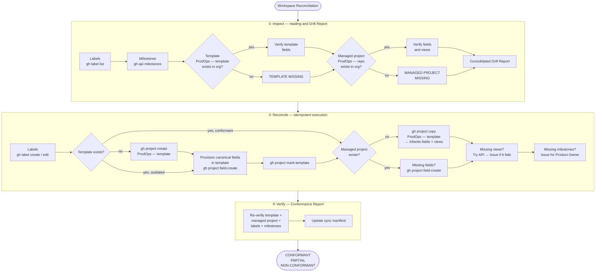

# GitHub Workspace — Canonical Specification

This file is the Canonical Specification of the product's GitHub Workspace infrastructure. The `inspect` step of the `workspace-reconciliation` capability reads this file and compares it with the Actual Workspace (actual repository state via API) to detect Workspace Drift.

---

## Workspace Reconciliation Flow

The `workspace-reconciliation` capability reads this Canonical Specification and compares it with the Actual Workspace to detect Workspace Drift, reconcile divergences, and produce a Conformance Report.



---

## Labels

### Family: operation

| Label | Color | Description |
|---|---|---|
| `operation:capture` | `#0075ca` | ProdOps operation: Capture |
| `operation:create` | `#0075ca` | ProdOps operation: Create |
| `operation:define` | `#0075ca` | ProdOps operation: Define |
| `operation:refine` | `#0075ca` | ProdOps operation: Refine |
| `operation:update` | `#0075ca` | ProdOps operation: Update |
| `operation:prototype` | `#0075ca` | ProdOps operation: Prototype |
| `operation:review` | `#0075ca` | ProdOps operation: Review |
| `operation:approve` | `#0075ca` | ProdOps operation: Approve |
| `operation:validate` | `#0075ca` | ProdOps operation: Validate |
| `operation:split` | `#0075ca` | ProdOps operation: Split |
| `operation:merge` | `#0075ca` | ProdOps operation: Merge |
| `operation:promote` | `#0075ca` | ProdOps operation: Promote |
| `operation:implement` | `#0075ca` | ProdOps operation: Implement |
| `operation:experiment` | `#0075ca` | ProdOps operation: Experiment |
| `operation:release` | `#0075ca` | ProdOps operation: Release |
| `operation:archive` | `#0075ca` | ProdOps operation: Archive |
| `operation:deprecate` | `#0075ca` | ProdOps operation: Deprecate |
| `operation:discard` | `#0075ca` | ProdOps operation: Discard |
| `operation:cancel` | `#0075ca` | ProdOps operation: Cancel |
| `operation:provision` | `#0075ca` | ProdOps operation: Provision |

### Family: artifact-type

| Label | Color | Description |
|---|---|---|
| `artifact-type:business-signal` | `#e4e669` | ProdOps artifact type: Business Signal |
| `artifact-type:business-intent` | `#e4e669` | ProdOps artifact type: Business Intent |
| `artifact-type:global-obc` | `#e4e669` | ProdOps artifact type: Global OBC |
| `artifact-type:local-obc` | `#e4e669` | ProdOps artifact type: Local OBC |
| `artifact-type:bdd-feature` | `#e4e669` | ProdOps artifact type: BDD Feature |
| `artifact-type:architecture` | `#e4e669` | ProdOps artifact type: Architecture |
| `artifact-type:iteration-plan` | `#e4e669` | ProdOps artifact type: Iteration Plan |
| `artifact-type:reliability-plan` | `#e4e669` | ProdOps artifact type: Reliability Plan |
| `artifact-type:release-trail` | `#e4e669` | ProdOps artifact type: Release Trail |
| `artifact-type:experiment` | `#e4e669` | ProdOps artifact type: Experiment |
| `artifact-type:evidence` | `#e4e669` | ProdOps artifact type: Evidence |
| `artifact-type:risk-register` | `#e4e669` | ProdOps artifact type: Risk Register |
| `artifact-type:context-capsule` | `#e4e669` | ProdOps artifact type: Context Capsule |

### Family: journey

| Label | Color | Description |
|---|---|---|
| `journey:discovery` | `#d93f0b` | ProdOps journey: Discovery |
| `journey:assessment` | `#d93f0b` | ProdOps journey: Assessment |
| `journey:delivery` | `#d93f0b` | ProdOps journey: Delivery |
| `journey:operation` | `#d93f0b` | ProdOps journey: Operation |
| `journey:diligence` | `#d93f0b` | ProdOps journey: Diligence |

---

## Milestones

Milestones represent product releases. Created by the Product Owner before each iteration.

| Milestone | Description |
|---|---|
| `v{major}.{minor}` | Product release — groups Issues of the corresponding iteration |

Milestones are managed by the Product Owner — they are not automatically provisioned by Diligence.

---

## GitHub Projects — Two managed projects

The framework maintains **two** GitHub Projects in the org, both identified by name (never by number):

| Role | Name | Scope |
|---|---|---|
| Canonical template | `ProdOps — template` | Org — source for `gh project copy` |
| Managed project | `ProdOps — <repo-name>` | Per repository — e.g.: `ProdOps — payments-api` |

**Manual projects are untouchable.** Any project whose name does not match one of these two patterns is ignored by Diligence — including projects created before the framework (e.g.: "Turma Junho 2026").

### ProdOps — template (org-level)

Project marked as template via `gh project mark-template`. Contains all canonical fields and canonical views. Serves as the source for `gh project copy` when creating managed projects for new repositories.

**When to create:** on the first execution of `workspace-reconciliation reconcile` if it does not yet exist.
**Creation:**
```bash
gh project create --owner <org> --title "ProdOps — template"
gh project edit <number> --owner <org> --visibility PUBLIC   # public by default
```
**After creation:** provision canonical fields via API, create views via REST, then `gh project mark-template`.
**Visibility:** PUBLIC by default. Change to PRIVATE only with an explicit directive.

### ProdOps — \<repo-name\> (per repository)

Project created via `gh project copy "ProdOps — template"`, inheriting fields and views automatically.

**When to create:** when the repository's managed project does not exist.
**Creation:**
```bash
gh project copy <template-number> \
  --source-owner <org> --target-owner <org> \
  --title "ProdOps — <repo-name>"
gh project edit <number> --owner <org> --visibility PUBLIC   # public by default
```
**Prerequisite:** the template must exist and be configured before copying.
**Visibility:** PUBLIC by default. `gh project copy` inherits the source visibility — verify and correct after copy if necessary.

**Link to repository (mandatory, not automatic):** `gh project copy` copies fields and views but **does not** link the project to the repository. Execute immediately after copy:
```bash
gh api graphql -f query='
  mutation {
    linkProjectV2ToRepository(input: {
      projectId: "<project-id>"
      repositoryId: "<repo-id>"
    }) { repository { nameWithOwner } }
  }'
```
Inspect verifies the link; Reconcile creates it automatically.

### Canonical Custom Fields (required in both projects)

| Field | Type | Options / Format |
|---|---|---|
| `Artifact Type` | single_select | enums from `artifact_type` in work-item-schema |
| `Artifact ID` | text | slug or relative path of the artifact |
| `Operation` | single_select | enums from `operation` in work-item-schema |
| `Journey` | single_select | Discovery, Assessment, Delivery, Operation, Diligence |
| `Execution Mode` | single_select | Upstream, Downstream, N/A |
| `Owner` | text | primary responsible party |
| `Release` | text | target version (e.g.: v2.1.0) |
| `Evidence Required` | single_select | `Required` (empty field = false) — implemented as SINGLE_SELECT while API does not support CHECKBOX in `ProjectV2CustomFieldType` |

### Canonical Views (required in both projects)

> **Automation via REST API (verified 2026-07-22):**
> ```bash
> curl -X POST "https://api.github.com/orgs/{org}/projectsV2/{projectNumber}/views" \
>   -H "Authorization: Bearer $TOKEN" \
>   -H "Accept: application/vnd.github+json" \
>   -d '{"name": "View Name", "layout": "table", "filter": "label:journey:delivery"}'
> ```
> Endpoint: `/orgs/{org}/projectsV2/{N}/views` (note: `projectsV2`, not `projects`).
> Supports: `name`, `layout` (table/board/roadmap), `filter`.
> **`group_by`:** Known Platform Limitation — GitHub API does not support configuring `group_by` in views (REST PATCH returns 404, GraphQL without existing mutation). Automation Opportunity via Browser Automation — the agent can configure via Browser Automation with user authorization. Never instruct the user to configure manually. See Principle 11 — [Automation First](automation-first.en.md).

| View | Filter | Grouping | Purpose |
|---|---|---|---|
| `All Work Items` | none | Journey | Complete view of work in progress |
| `By Operation` | none | Operation | Triage by operation type |
| `Business Signals` | `label:artifact-type:business-signal` | Status | Operational tracking list |
| `Delivery` | `label:journey:delivery` | Status | Tracking of Delivery in progress |
| `Diligence` | `label:journey:diligence` | Operation | Active work of the Diligence journey |

**Create views in the template (once):**
Canonical views are created automatically by the `reconcile` step of the `workspace-reconciliation` capability via REST API. Run `workspace-reconciliation reconcile` — the agent creates the views programmatically and confirms via `workspace-reconciliation verify`. From that point on, all new projects inherit the views via `gh project copy`.

> **Historical note:** earlier versions of this specification described the manual creation of views via the GitHub UI. That flow was superseded by REST API automation (verified 2026-07-22). See Principle 11 — [Automation First](automation-first.en.md).

---

## References

→ [Work Item Schema](execution-mapping/work-item-schema.en.md) — fields, enums, and canonical title
→ [Workspace Reconciliation capability](journeys/diligence/workspace-reconciliation.md)
→ GitHub Sync Manifest: `prodops/artifacts/trails/github-sync-manifest.md` (created by the product)
