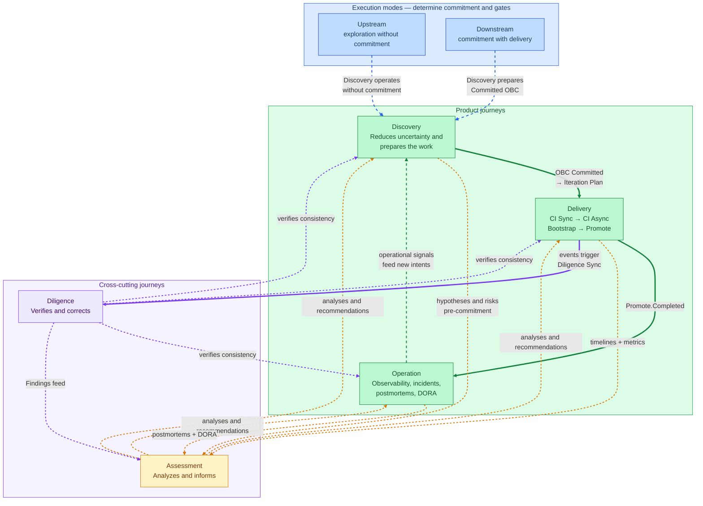

# Journeys

The ProdOps Framework has five journeys organized in two groups.

---

## Fundamental separation

**Execution modes are not journeys.**

| Concept | What it is | Example |
|---|---|---|
| **Mode** | Determines the level of commitment and quality gates applied | Upstream, Downstream |
| **Product journey** | Describes the work path oriented to the product | Discovery, Delivery, Operation |
| **ProdOps journey** | Accompanies product journeys transversally | Assessment, Diligence |
| **Backlog** | Organizes work before and during execution | Product Backlog, Icebox, Iteration Backlog |
| **Plan** | Records the execution of an iteration | Iteration Plan |

Upstream and Downstream are modes, not journeys. **Each of the 5 journeys exists in both modes** — with advisory rigor in Upstream and blocking rigor in Downstream. No journey is exclusive to one mode.

---

## Responsibility of each journey

| Journey | Sole responsibility |
|---|---|
| [Discovery](discovery/) | Reduce uncertainty and prepare the work |
| [Delivery](delivery/) | Build, validate and promote the solution |
| [Operation](operation/) | Operate and evolve the product in production |
| [Assessment](assessment/) | Produce analyses to support decisions |
| [Diligence](diligence/) | Ensure consistency of the ProdOps work system |

---

## Relationship between journeys



---

## Journeys by mode

The 3 product journeys and the 2 cross-cutting journeys exist **in both modes**. The mode determines the rigor — not which journeys are available.

> **Attention:** the market reading — "upstream = discovery, downstream = delivery" — does not apply here. Upstream and Downstream are execution modes, not phases of a linear process.

```
                UPSTREAM                        DOWNSTREAM
            (advisory rigor)                (blocking rigor)
                   │                               │
   Discovery   exploratory                   preparatory (Icebox)
   Delivery    advisory/sandbox              mandatory/production
   Operation   experimental/sandbox          real production
   Assessment  informs, does not block       can block gates
   Diligence   light                         blocking
                   │                               │
              CommitmentGate ─────────────────────►│
              (mode transition gate)
```

## Upstream flow

```
Intent
  ↓
Upstream (advisory rigor — the engineer decides what to apply)
  ├─ Discovery (exploratory): experiments, prototypes, spikes
  ├─ Delivery  (advisory):    Bootstrap/Hack/Finish/Ship available
  ├─ Operation (experimental): observable sandbox
  ├─ Assessment (optional):   risk analysis when useful
  └─ Diligence (light):       artifact consistency as needed
  ↓
CommitmentGate (when Decision Package is ready)
  ↓
Downstream (if outcome = Promote)
```

There is no delivery commitment. The goal is to reduce uncertainty. An Intent may remain indefinitely in Upstream, be discarded, return to Portfolio, or proceed to Downstream.

---

## Downstream flow

```
Intent
  ↓
Downstream (blocking rigor — all phases and gates mandatory)
  ├─ Discovery (preparatory): Icebox → Committed OBC → committed BDD
  ├─ Delivery:  Bootstrap → Hack → Sync → Finish → Ship → Validate → Promote
  ├─ Operation: real production, SLOs, runbooks, incidents
  ├─ Assessment: formal gates, Reliability Plan mandatory when applicable
  └─ Diligence: mandatory synchronization, blocking findings
  ↓
Continuous Operation (generates new Business Signals)
```

There is a delivery commitment, validation, governance, and reliability.

---

## Canonical phrase — for any synthesis or summary

> **The mode defines the rigor — not the journeys.**
> **The same 5 journeys exist in both modes; what changes is the commitment.**

Any synthesis that maps Upstream to a specific journey ("Upstream learns", "Upstream is discovery", "Upstream is exploration") or Downstream to another ("Downstream delivers", "Downstream is delivery") is incorrect — it reproduces the market interpretation, not the ProdOps model.

---

## Relationship between journeys and backlogs

| Backlog | Responsible |
|---|---|
| Portfolio Tracking List | Portfolio (Assessment signals) |
| Product Tracking List | Product Owner (Assessment signals) |
| Product Backlog | Product Owner manages; Diligence synchronizes consistency |
| Icebox | Discovery (Downstream) — preparation |
| Iteration Backlog | Product Owner + Diligence |
| Iteration Plan | Delivery — execution |

The **Product Backlog** is managed by the Product Owner. Diligence synchronizes artifact state and tools — it does not manage the backlog. Diligence ensures consistency; prioritization is the Product Owner's responsibility.

Discovery in Downstream operates within the Icebox.
Delivery begins only when an item enters the Iteration Plan.

---

## Cross-cutting journeys

Assessment and Diligence are not steps in a linear flow — they are journeys that accompany the three product journeys simultaneously. The difference between them is not position, but **focus**: Assessment analyzes and informs; Diligence verifies and corrects.

```
               DISCOVERY     DELIVERY     OPERATION
                   │             │             │
                   │             │             │
ASSESSMENT ────────┼─────────────┼─────────────┤
                   │             │             │
DILIGENCE  ────────┼─────────────┼─────────────┤
                   │             │             │
                   ▼             ▼             ▼
```

The weight and effort of each cross-cutting journey varies according to the product journey in which they operate:

| | Discovery | Delivery | Operation |
|---|---|---|---|
| **Assessment** | Medium — evaluates hypotheses, risks, and pre-commitment readiness | High — formal entry gate + retrospective timeline analysis | High — postmortems, DORA, operational signals feed new intents |
| **Diligence** | Light — consistency of exploratory artifacts | High — synchronizes OBC, events, timelines, and Project state in real time | Medium — detects accumulated artifact drift and operational conformance |

---

### Assessment

Produces analyses and recommendations that support decisions. Does not block the flow on its own — it generates inputs that other actors use to decide.

**Central question:** What do we know, what do we not know, and what must we decide before advancing?

→ [Assessment — full specification](assessment/README.en.md)

---

### Diligence

Verifies that the ProdOps work system remains coherent and traceable. Operates reactively (synchronously) to delivery events and proactively (asynchronously) to detect accumulated drift.

**Central question:** Are knowledge, decisions, execution, and evidence still coherent and traceable?

Diligence operates in exactly two cycles:
- **diligence-sync** — synchronous, reactive, contextual, tied to an ongoing operation
- **diligence-async** — asynchronous, proactive, for detecting accumulated drift

Capabilities such as Workspace Reconciliation are subroutines consumed by the Cycles — they are not independent Cycles.

→ [Diligence — full specification](diligence/README.en.md)

---

→ [Execution Model](../execution-model/README.en.md)
→ [Backlog hierarchy](../backlogs.en.md)
