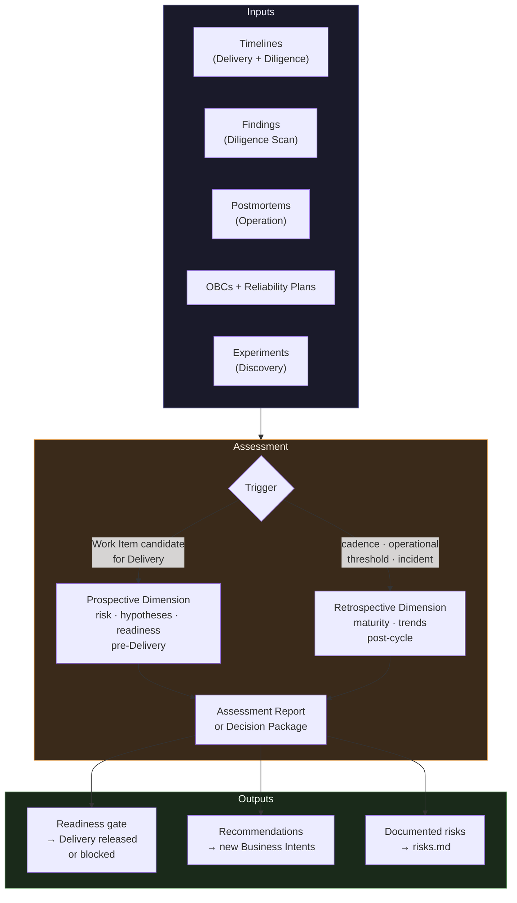

[Portuguese](README.md)

# Assessment — Journey Foundation
# ProdOps Framework

> **Version:** 1.0.0
> **Status:** Canonical
> **Depends on:** [OEM Timeline](../../events/timeline.md) · [Delivery](../delivery/README.md) · [Diligence](../diligence/README.md)

---



## Central question

> **"Are we continuously improving our operational model?"**

Assessment is the Journey that evaluates the operational model over time. It does not execute
Delivery. It does not execute Diligence. It consumes the evidence produced by both to
evaluate maturity, identify trends, and produce evolution recommendations.

Assessment also acts as a quality gate before execution — evaluating risks,
hypotheses, and readiness of Work Items before they enter Delivery. These two dimensions
(prospective and retrospective) compose the full mission of the Journey.

---

## 1. Mission

### 1.1 Purpose

Assessment exists to close the continuous improvement cycle of the Framework. While Delivery
executes and Diligence verifies, Assessment evaluates whether the accumulated result represents
real evolution of the operational model — and whether the next Work Items have conditions to
be executed with quality.

Without Assessment, the Framework produces without reflecting. With Assessment, each execution cycle
feeds the learning of the next.

**Prospective dimension:** evaluates hypotheses, risks, and readiness before Delivery.
**Retrospective dimension:** evaluates what Timelines and Findings reveal about the model.

### 1.2 Start

An Assessment can be initiated by four triggers:

| Trigger | Example |
|---|---|
| **Periodic cadence** | Quarterly review, post-release review |
| **Operational threshold** | Gate Failure Rate > 20% in 30 days; Cycle Time increased 40% |
| **External signal** | Incident with production impact; postmortem completed |
| **Explicit request** | Work Item candidate for Delivery without Assessment performed |

### 1.3 End

An Assessment ends when:

1. The result has been formally published (Assessment Report or Decision Package)
2. Recommendations have been formalized and assigned
3. The next Assessment trigger has been defined

An Assessment does not end when the analysis is complete — it ends with the publication of the result
and the definition of the next cycle. Without publication, the analysis produced no effect.

### 1.4 Inputs

| Input | Source | What it provides |
|---|---|---|
| **Operational Timelines** | Delivery, Diligence | Sequence of events per Work Item — primary source of metrics |
| **Derived Metrics** | Timelines (calculated) | Lead Time, Cycle Time, Block Time, DORA, Gate Failure Rate, Rework Rate |
| **Findings** | Diligence (Scan) | Structural findings — observed anomalies |
| **Divergence reports** | Diligence (Scan) | Non-conformance patterns across scan cycles |
| **OBCs** | Artifacts | Business context of the analyzed Work Items |
| **Reliability Plans** | Artifacts | Risk and reliability commitments made |
| **Release Trails** | Artifacts | Deploy frequency, rollback rate, release history |
| **Evidence References** | Event Instances (OEM) | Evidence linked to events recorded in Timelines |
| **Experiments and hypotheses** | Discovery | Research learnings that inform prioritization decisions |
| **Postmortems and incidents** | Operation | Production failure signals that update risk evaluation |

### 1.5 Outputs

| Output | Dimension | Description |
|---|---|---|
| **Assessment Report** | Retrospective | Formalized analysis with metrics, patterns, and period conclusions |
| **Recommendations** | Retrospective | Specific, assigned, and prioritized actions for model improvement |
| **Evolution Plan** | Retrospective | Roadmap for evolving Journeys or the Framework |
| **Decision Package** | Prospective | Set of evidence and recommendations for a specific decision |
| **Reliability Plan** | Prospective | Risk and reliability plan for Work Items that require a gate |
| **New Business Intents** | Both | OBCs proposed based on identified opportunities |
| **Process improvement proposals** | Both | Adjustments to Delivery or Diligence without altering the model |
| **Framework update suggestions** | Both | Formal proposals for Framework revision |

---

## 2. Responsibilities

### 2.1 What belongs to Assessment

- Evaluate operational maturity based on Timeline evidence
- Calculate and interpret metrics derived from Timelines
- Identify patterns and trends over time
- Synthesize Diligence Findings into model-level conclusions
- Evaluate risks, opportunities, and hypotheses before Delivery
- Produce Reliability Plans for Work Items that require a formal gate
- Formulate actionable recommendations for improvement
- Propose evolutions to Journeys or the Framework
- Continuously monitor operational health indicators
- Publish results formally (Assessment Report, Decision Package)

### 2.2 What does NOT belong to Assessment

| Prohibited action | Why |
|---|---|
| Execute Bootstrap, Hack, Sync, Finish, Ship, Validate, Promote | Execution belongs to Delivery |
| Execute Capture, Attach, Scan, Flag, Repair | Execution belongs to Diligence |
| Create or emit Operational Events | Assessment does not write to Timelines |
| Modify existing Timelines | Timelines are immutable — consumption is read-only |
| Manage Work Items individually | Responsibility of Delivery and Diligence |
| Approve or reject individual promotions | Operational decisions belong to execution Journeys |
| Create Event Types or Shared Types | OEM governance — not Assessment's responsibility |
| Modify event catalogs | Framework responsibility via OEM governance |
| Prioritize the backlog directly | Prioritization belongs to Discovery or the product owner |

---

## 3. Relationship with other Journeys

Assessment is a read-only consumer of the outputs of other Journeys. There is no direct coupling
with Delivery or Diligence — all information arrives via immutable artifacts (Timelines,
Findings, Reports, Evidence).

```
Discovery ──────────────────────────────────┐
  Experiments and learnings                  │
  Hypotheses to evaluate                     │
                                             │
Delivery ───────────────────────────────────┤
  Timelines (Lead Time, Cycle Time,          │
  Block Time, Gate Failure Rate,             │
  Rework Rate, DORA metrics)                 ├──► ASSESSMENT
  Release Trails                             │         │
  OBCs                                       │         │
                                             │         ▼
Diligence ──────────────────────────────────┤   Assessment Report
  Scan Findings                             │   Decision Package
  Divergence patterns                       │   Recommendations
  Conformance trends                         │   Evolution Plan
  Waiver history                             │   Reliability Plans
                                             │
Operation ──────────────────────────────────┘
  Incidents and postmortems
  Production signals
```

### 3.1 Delivery → Assessment (read)

| Artifact | What Assessment reads |
|---|---|
| Timelines | Event sequence for metric calculation and trend analysis |
| Release Trails | Frequency and quality of releases |
| OBCs | Business context — correlates metrics with objectives |
| Gate history (via Timeline) | Gate failure rate by category and period |

### 3.2 Diligence → Assessment (read)

| Artifact | What Assessment reads |
|---|---|
| Scan Findings | Structural anomalies identified by scan |
| Divergence records | Non-conformance patterns — frequency, severity, type |
| Waiver history | Granted exceptions — indicator of accumulated conformance debt |
| Conformance rate | Proportion of Work Items in conformance over time |

### 3.3 Assessment → Delivery (indirect)

Assessment does not modify Delivery directly. Its outputs that influence Delivery:
- **Decision Package** that defines whether a Work Item can enter the Iteration Plan
- **Reliability Plan** that is an additional gate for high-risk Work Items
- **Recommendations** that can propose: new gate criteria, phase adjustments, new OBCs

The implementation of these changes occurs via Framework governance — Assessment proposes,
the Framework governs, Delivery executes.

### 3.4 Assessment → Diligence (indirect)

Assessment can propose new scan criteria or conformance rules via recommendations.
Diligence executes them only after approval via Framework governance.

### 3.5 What never happens

- Assessment does not call Delivery to re-execute a Work Item
- Assessment does not trigger Scan cycles in Diligence
- Assessment does not approve individual Work Item artifacts
- Assessment does not emit events in other Journeys' Timelines
- Assessment does not prioritize the backlog — it informs, not decides

---

## 4. Inputs — detail

### 4.1 Operational Timelines (primary input)

The Timeline is the most valuable input for retrospective Assessment. Each Work Item Timeline
contains the complete sequence of events with timestamps — the only truthful record of how
work actually happened.

From the Timeline, Assessment derives:

```
Lead Time(W)      = timestamp(Done) - timestamp(first event)
Cycle Time(W)     = timestamp(Done) - timestamp(development start)
Block Time(W)     = Σ (Impediment.Resolved.ts - Impediment.Declared.ts)
Rework Cycles(W)  = count(Rework.Declared in Timeline(W))
Gate Failure Rate = count(Gate.Failed) / count(Gate.Passed + Gate.Failed)
```

### 4.2 Diligence Findings

Findings do not alter the Derived State of Work Items — they are audit observations.
Assessment uses them to identify patterns: what types of Finding recur? In what
contexts? How often? This indicates where the operational model has structural gaps.

### 4.3 OBCs as context

OBCs allow correlating metrics with business objectives. A high Cycle Time may be
acceptable for high-complexity OBCs and unacceptable for critical OBCs. Without OBCs
as context, metrics are numbers — with them, they are indicators.

### 4.4 Reliability Plans

Reliability Plans define the risk commitments made before each Delivery.
Retrospective Assessment evaluates: were the plans effective? Did the identified
risks materialize? Were there unforeseen risks? This calibrates future plans.

### 4.5 Postmortems and incidents (via Operation)

Production incidents and their postmortems are signals of operational model failure.
Assessment uses them to identify: did the Delivery model detect the risk beforehand? Did
Diligence signal any related divergence? The answer informs the maturity evaluation and
recommendations.

---

## 5. Outputs — detail

### 5.1 Assessment Report

The Assessment Report is the formal product of a retrospective cycle. It includes:

- Analyzed period and Work Item scope
- Calculated metrics with trend (improving / stable / degrading)
- Identified patterns (positive and negative)
- Probable causes of identified patterns
- Correlation with Diligence Findings and Divergences
- Conclusion on operational maturity in the period

### 5.2 Decision Package

The Decision Package is the formal product of a prospective cycle. It includes:

- Context of the Work Item or hypothesis evaluated
- Identified risks and opportunities
- Feasibility and adequacy analysis
- Objective recommendation: advance / pause / reject

### 5.3 Recommendations

Each Recommendation is specific, assigned, prioritized, and traceable to the evidence that
supports it. Examples:

- "Reduce Gate Failure Rate in CI-lint from 34% to <10% — responsible: Delivery Skills review"
- "Update Diligence scan criteria to include Evidence References verification"
- "OBC X shows Cycle Time 3x above average — investigate Bootstrap preconditions"

### 5.4 Evolution Plan

Result of Assessments that identify the need for structural change. Proposes:
changes to Skills or Capabilities, new cycles or phases, promotion of types to
Shared Types, revision of Ontology or Taxonomy concepts.

---

## 6. Cycles

Assessment operates in two independent cycles:

### 6.1 Assessment Sync — Structured Review

Formal cycle, triggered by a defined trigger.

```
Collect → Analyze → Synthesize → Report
```

| Step | What happens |
|---|---|
| **Collect** | Collection and indexing of evidence from Timelines and artifacts of the period |
| **Analyze** | Metric calculation, pattern identification, Finding correlation |
| **Synthesize** | Consolidation of insights into high-level conclusions |
| **Report** | Formalization and publication of the Assessment Report or Decision Package |

**Trigger:** periodic cadence, external signal, or explicit request.
**Output:** Assessment Report + Recommendations; or Decision Package + Reliability Plan.

### 6.2 Assessment Async — Continuous Monitoring

Continuous cycle, without a discrete trigger — permanently observes the operational model.

```
Monitor → Alert → Evolve
```

| Step | What happens |
|---|---|
| **Monitor** | Continuous observation of metrics derived from Timelines and Findings |
| **Alert** | Detection of crossed thresholds or anomalies — generates signal for Sync |
| **Evolve** | Incremental improvement proposals that do not require a full Sync cycle |

**Trigger:** continuous (no discrete start and end per cycle).
**Output:** alert signals for Assessment Sync; incremental Evolution proposals.

### 6.3 Interaction between cycles

```
Assessment Async (permanent Monitor)
    │
    │ threshold crossed or anomaly detected
    ▼
Assessment Sync (structured review triggered)
    │
    │ Report published
    ▼
Assessment Async (resumes monitoring)
```

---

## 7. Capabilities

| Capability | Description |
|---|---|
| **Evidence Collection** | Collection, indexing, and qualification of evidence from Timelines and artifacts of other Journeys |
| **Metric Derivation** | Calculation of operational metrics from Timelines (Lead Time, Cycle Time, Block Time, DORA, Gate Failure Rate) |
| **Pattern Recognition** | Identification of temporal and structural patterns in collected data — improvement or degradation trends |
| **Maturity Evaluation** | Assessment of operational maturity level based on identified patterns |
| **Risk and Opportunity Analysis** | Prospective analysis of risks and opportunities before Work Items enter Delivery |
| **Recommendation Synthesis** | Formulation of specific, assigned, and prioritized Recommendations with cited evidence |
| **Evolution Proposal** | Formal proposal for evolution of Journeys, Skills, Capabilities, or the Framework with evidence-based justification |
| **Continuous Monitoring** | Permanent observation of operational health indicators — detects thresholds and anomalies |

---

## 8. Integration with the Operational Event Model

### 8.1 Assessment is a read-only consumer

Assessment is a Consumer of Timelines — it reads, never writes. The immutability of
Timelines ensures that the source of truth is never contaminated by the analysis process.

```
Timeline(W) ──read-only──► Assessment Consumer
                              │
                              ├── calculates metrics
                              ├── identifies patterns
                              ├── applies Lookback
                              └── does not emit events
```

### 8.2 Use of Derived State

Assessment uses Derived State to understand the current state of sets of Work Items:
- How many Work Items are in BLOCKED now?
- How many have been in VALIDATING for more than N days?
- What is the distribution of Derived States at a given moment?

Derived State is not stored — Assessment recalculates it on demand over the Timelines.

### 8.3 Use of Lookback

Assessment uses Lookback (formalized in `timeline.md`) for retroactive queries:
- What was the Derived State of a Work Item on a specific date?
- How long did a Work Item spend in each state?
- When did a Gate Failure pattern first appear?

Lookback is read-only and idempotent — Assessment can repeat it indefinitely.

### 8.4 Use of Replay (conceptual)

To reconstruct historical states of sets of Work Items:
- What was the distribution of Derived States in 2026-Q1?
- How did the average Lead Time evolve between 2025-Q4 and 2026-Q1?

Replay is read-only and historical — it does not alter any Timeline.

### 8.5 What Assessment does NOT do with the OEM

- **Does not create Event Types** — no new event types for Assessment or any Journey
- **Does not emit Events** — does not produce event instances in Delivery or Diligence Timelines
- **Does not alter Timelines** — strictly read-only consumption
- **Does not create Shared Types** — type promotion is the Framework's responsibility via `lifecycle.md`

### 8.6 Assessment and its own Timeline

Assessment does not have a Timeline in the current MVP — its results are textual artifacts
(Assessment Report, Recommendations, Evolution Plan). In future versions, Assessment
may have its own Timeline to formally record cycles via OEM.

---

## 9. Success criteria

| # | Criterion | Verification |
|---|---|---|
| 1 | Analysis scope and period were explicitly defined | Report contains time window and Work Item scope |
| 2 | Evidence was collected from complete Timelines of the period | At least one Timeline per Delivery and/or Diligence cycle in scope |
| 3 | Core metrics were calculated (retrospective cycle) | Lead Time, Cycle Time, Block Time, Gate Failure Rate present |
| 4 | Trend was classified | Each metric: improving / stable / degrading |
| 5 | At least one pattern was identified and explained | Pattern recognition produced at least one grounded conclusion |
| 6 | At least one Recommendation or Decision was produced | Specific, assigned, prioritized, with cited evidence |
| 7 | The result was formally published | Artifact available in `prodops/artifacts/` |
| 8 | The next Assessment trigger was defined | Date or threshold explicitly recorded |

---

## 10. Boundaries with other Journeys

```
┌──────────────────┬──────────────────┬──────────────────┬──────────────────┐
│ Dimension        │ Delivery         │ Diligence        │ Assessment       │
├──────────────────┼──────────────────┼──────────────────┼──────────────────┤
│ Question         │ How do I deliver?│ Am I conformant? │ Am I improving?  │
│ Level            │ Individual       │ Individual       │ Aggregate        │
│ Temporality      │ Transactional    │ Periodic         │ Retrospective /  │
│                  │ (per Work Item)  │ verification     │ continuous       │
│ OEM write        │ Yes (emits       │ Yes (emits       │ No (read-only)   │
│                  │ events)          │ events)          │                  │
│ Primary output   │ Software in      │ Conformance      │ Insights and     │
│                  │ production       │ (yes/no)         │ recommendations  │
│ Work object      │ Work Item (OBC)  │ Work Item (OBC)  │ Operational      │
│                  │                  │                  │ model            │
│ Trigger          │ Work Item in     │ Periodic scan    │ Cadence /        │
│                  │ Iteration Plan   │ or divergence    │ threshold / signal│
│ OEM coupling     │ Producer         │ Producer         │ Consumer         │
└──────────────────┴──────────────────┴──────────────────┴──────────────────┘
```

---

## Artifacts

| Artifact | Location |
|---|---|
| Risks | [../../../artifacts/risks/risks.md](../../../artifacts/risks/risks.md) |
| Opportunities | [../../../artifacts/risks/opportunities.md](../../../artifacts/risks/opportunities.md) |
| Reliability Plans | [../../../artifacts/plans/reliability/](../../../artifacts/plans/reliability/) |
| Event Storming | [../../../artifacts/event-storming/](../../../artifacts/event-storming/) |
| Architecture | [../../../artifacts/architecture/](../../../artifacts/architecture/) |
| OBCs (reference) | [../../../artifacts/obcs/](../../../artifacts/obcs/) |
| Iteration Plans (reference) | [../../../artifacts/plans/](../../../artifacts/plans/) |

---

## References

- [OEM Foundation](../../events/README.md)
- [OEM Timeline](../../events/timeline.md)
- [Event Type Schema](../../events/event-type-schema.md)
- [Delivery Journey](../delivery/README.md)
- [Diligence Journey](../diligence/README.md)
- Cross-Journey Event Analysis


---

→ **Next:** [Diligence Journey](../diligence/README.en.md)
