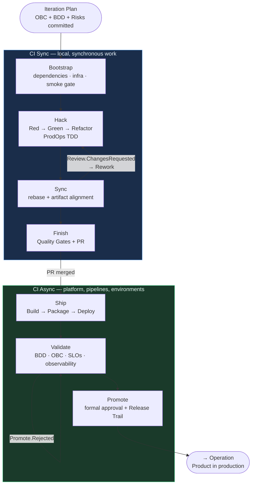

# Delivery Journey



Delivery is the implementation journey of the ProdOps Framework.

## Responsibility

Build, validate and promote the solution. Delivery represents the execution of the iteration — it does not prioritize, does not do Discovery, and does not replace any backlog.

## Entry point

Delivery begins only when an item enters the **Iteration Plan**.

The entry point of Delivery is **not**:
- Intent
- Icebox
- Iteration Backlog

An item only enters the Iteration Plan when it has a committed OBC + committed BDD Feature + documented risks. The Reliability Plan is an additional gate **when** there is financial movement, external integration, SLO change, high/critical risk, or persistence/security change. Outside these triggers, the Reliability Plan is optional.

## Flow

```
Iteration Plan
  ↓
CI Sync: Bootstrap → Hack → Sync → Finish     (local, synchronous work)
  ↓
CI Async: Ship → Validate → Promote            (platform, pipelines, environments)
  ↓
Operation
```

## CI Sync

→ [ci-sync.md](ci-sync.md)

## CI Async

→ [ci-async.md](ci-async.md)

## Phases

| Phase | Description | Link |
|---|---|---|
| Bootstrap | Dependencies + local infrastructure + configuration + smoke gate | [phases/bootstrap/README.md](phases/bootstrap/README.md) |
| Hack | Implementation via ProdOps TDD | [phases/hack/README.md](phases/hack/README.md) |
| Sync | Artifact consistency | [phases/sync/README.md](phases/sync/README.md) |
| Finish | Quality Gates + PR | [phases/finish/README.md](phases/finish/README.md) |
| Ship | Preparation + Deployment | [phases/ship/README.md](phases/ship/README.md) |
| Validate | Runtime + observability + SLO | [phases/validate/README.md](phases/validate/README.md) |
| Promote | Formal approval + Release Trail | [phases/promote/README.md](phases/promote/README.md) |

## Practices

→ [practices/prodops-tdd.md](practices/prodops-tdd.md)
→ [practices/testing-policy.md](practices/testing-policy.md)
→ [practices/integration-testing-policy.md](practices/integration-testing-policy.md)

## Shared Capabilities

→ [capabilities/](capabilities/)
