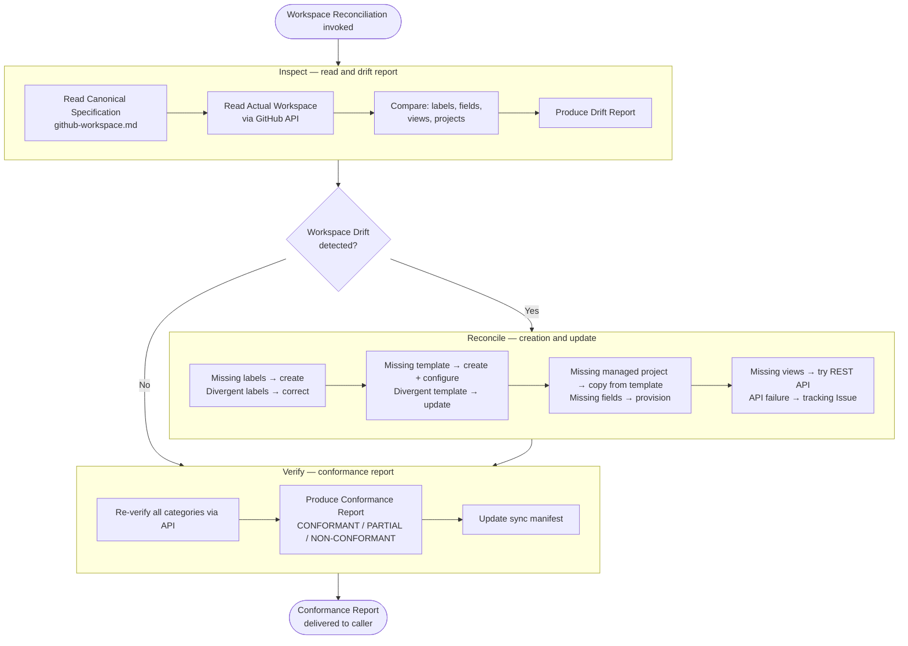

# Workspace Reconciliation

Workspace Reconciliation is a **Capability** of ProdOps Diligence — it is not a Cycle, it is not a Phase of any Cycle, and it has no independent trigger of its own.

It is invoked as a subroutine by the diligence-sync and diligence-async cycles, and by Bootstrap. Any point of the Framework that needs to align the GitHub Workspace infrastructure can invoke this Capability — it returns a Conformance Report to the caller and does not persist execution state.

It keeps the GitHub Workspace (Labels, Custom Fields, Views, managed projects) aligned with the **Canonical Specification** defined in `prodops/framework/github-workspace.md`.

> **Principle:** The Canonical Specification is the source of truth. The Actual Workspace is the real state of GitHub. Any divergence between the two is called **Workspace Drift** and must be detected, corrected and verified before any journey that depends on the infrastructure.

---

## Core concepts

| Concept | Definition |
|---|---|
| **Canonical Specification** | The file `prodops/framework/github-workspace.md` — defines what the GitHub Workspace must contain: labels, fields, views and managed projects. It is the normative source of truth. |
| **Actual Workspace** | The real state of GitHub resources (org, repository, projects) read via API at execution time. |
| **Workspace Drift** | Any divergence between Canonical Specification and Actual Workspace — missing labels, missing fields, uncreated views, projects out of spec. |

---

## Internal steps: Inspect → Reconcile → Verify

The Inspect, Reconcile and Verify steps are **internal steps of this Capability** — they are not Phases of any Diligence Cycle. They are executed exclusively within the scope of a Workspace Reconciliation invocation.

**Source of truth hierarchy (respected by Reconcile):**
1. Canonical Specification (`prodops/framework/github-workspace.md`) — normative source
2. Actual Workspace (real GitHub state read via API) — state to be corrected

Reconcile never inverts this hierarchy: when there is a conflict, the Canonical Specification prevails.

## Flow: Inspect → Reconcile → Verify



---

## Integration with Bootstrap

Workspace Reconciliation is invoked during Bootstrap of new repositories to ensure that the GitHub infrastructure is ready before any Delivery work.

```
Repository Bootstrap
       │
       ▼
Workspace Reconciliation
       │
       ▼
GitHub Workspace
```

Bootstrap calls Workspace Reconciliation as a precondition. If the Conformance Report returns `NON-CONFORMANT`, Bootstrap stops and records the block before proceeding.

---

## Integration with Diligence Async

The Diligence Async cycle invokes Workspace Reconciliation when Scan detects signs of Workspace Drift (Issues without canonical labels, projects without expected fields).

```
Diligence Async
       │
       ▼
    Inspect
       │
       ▼
 Workspace Drift?
   ┌───┴────┐
   │        │
  No       Yes
   │        │
   │        ▼
   │    Reconcile
   │        │
   └────────▼
        Verify
```

The Async cycle does not call Workspace Reconciliation on every scan — only when Scan detects explicit drift in the infrastructure.

---

## Integration with Diligence Sync

The Diligence Sync cycle can invoke Workspace Reconciliation when the Attach or Promote step fails due to missing canonical label or required field in the Project. In this case, Workspace Reconciliation is executed as a correction subroutine before resuming the main flow.

---

## Scope: what Workspace Reconciliation manages

### What it MANAGES

| Resource | Examples |
|---|---|
| GitHub Labels | `operation:capture`, `journey:delivery`, `artifact-type:local-obc` |
| GitHub Project Fields | `Artifact Type`, `Operation`, `Journey`, `Evidence Required` |
| GitHub Project Views | `All Work Items`, `By Operation`, `Delivery`, `Diligence` |
| GitHub Projects (managed) | `ProdOps — template`, `ProdOps — <repo-name>` |

### What it does NOT manage

| Out of scope | Justification |
|---|---|
| Cloud infrastructure (AWS, GCP, Azure) | Ops/Infra domain — outside ProdOps |
| Kubernetes / Helm / manifests | Outside GitHub Workspace scope |
| Terraform / Pulumi / IaC | Infrastructure provisioning — not GitHub Workspace |
| CI/CD pipelines (GitHub Actions workflows) | Product/automation code — Delivery domain |
| Runtime environments (staging, prod) | Operational — Operation domain |
| Individual GitHub Issues | Synchronized by Diligence Sync and Async |
| Milestones | Created by Product Owner — Workspace Reconciliation only detects absence and records Issue |

---

## Steps

| Step | Responsibility | Restrictions | File |
|---|---|---|---|
| **Inspect** | Reads Canonical Specification and Actual Workspace; produces complete Drift Report. | **Creates nothing, modifies nothing, removes nothing** — pure read. | [steps/inspect/SKILL.md](../../../skills/diligence/workspace-reconciliation/steps/inspect/SKILL.md) |
| **Reconcile** | Executes creations and updates identified by Inspect. For non-automatable gaps, opens tracking Issue. | Never removes without confirmation; respects the source of truth hierarchy; never alters Knowledge Space artifact content. | [steps/reconcile/SKILL.md](../../../skills/diligence/workspace-reconciliation/steps/reconcile/SKILL.md) |
| **Verify** | Programmatically confirms the state of all categories after Reconcile. Produces Conformance Report and updates sync manifest. | Does not apply new corrections; only confirms the Reconcile result. | [steps/verify/SKILL.md](../../../skills/diligence/workspace-reconciliation/steps/verify/SKILL.md) |

---

## Guardrails

- **Never operate on manual projects** — any project whose name does not start with `ProdOps — ` is ignored.
- **Identify projects by exact name, never by number** — the number changes with each recreation; the name is the contract.
- **No gap without tracking Issue** — non-automatable divergences generate an Issue with responsible party and resolution criterion.
- **Never declare "manual action" as floating text** — the instruction for the human goes in the Issue body; the output lists Automation Opportunities and Known Platform Limitations.
- **Automation First (Principle 8)** — try API → MCP → CLI → SDK → Browser Automation before declaring any limitation. Manual Exception only when everything fails, always with open tracking Issue. See [automation-first.md](../../automation-first.md).
- **Sync manifest as record of truth** — updated by Verify at the end of each execution.

---

## References

→ [Canonical Specification — github-workspace.md](../../github-workspace.md)
→ GitHub Sync Manifest: `prodops/artifacts/trails/github-sync-manifest.md` (created by the product)
→ [Diligence journey README](../../README.md)
→ [Capabilities README](capabilities/README.md)
→ [Orchestrator SKILL.md](../../../skills/diligence/workspace-reconciliation/SKILL.md)
