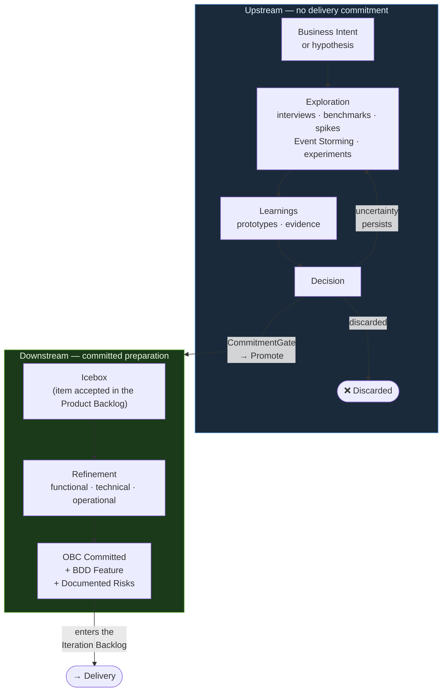

# Discovery



## Purpose

Discovery is the ProdOps exploration and preparation journey. It exists in both Upstream and Downstream with different responsibilities; it is not synonymous with Upstream.

---

## Discovery in Upstream

**Objective:** Explore.

No obligation to complete artifacts. No mandatory gates. The engineer decides which Skills to use. The expected result is learning.

Can include:

- interviews and benchmarks
- Event Storming
- prototypes and spikes
- experiments and vibecoding
- research

An Upstream experiment may produce production-quality code. The exploratory label describes the commitment model — no mandatory gates, no Committed OBC, no Release Trail — not the deployment limit. By explicit team and leadership decision, this code may be deployed to production or controlled productive environments without requiring formal promotion to Downstream. The CommitmentGate formalizes the mode transition; it is not a precondition for deployment.

---

## Discovery in Downstream

**Objective:** Prepare a committed item for Delivery.

An item enters the Icebox after being accepted in the Product Backlog. Discovery in Downstream occurs within the Icebox. The goal is to produce a Local OBC in the Committed state through refinement:

- functional — what the system must do
- technical — how the system must do it
- operational — how the system must behave in production

At the end of Discovery in Downstream, the item has a Local OBC in the Committed state and advances to the Iteration Backlog.

---

## General objectives

Discovery exists to:

- understand business problems;
- validate technical approaches;
- explore provider capabilities;
- prototype integrations;
- validate business flows;
- reduce implementation risks;
- evolve Product knowledge.

---

# Repository Scope Gate

Before creating an experiment, BDD Feature, OBC, prototype, Validation Workbench change
or any execution artifact, confirm that the capability can be developed
or validated within this repository.

Create execution artifacts only when this repository owns or can directly exercise
at least one of the following:

- API behavior;
- domain logic;
- provider integration;
- webhook handling;
- persistence;
- Payments API-owned contracts;
- Validation Workbench flow;
- executable tests or evidence.

If the request depends on implementation owned by another repository or system,
do not create a Feature, experiment, prototype or execution artifact here.
Record only as:

- external dependency;
- release risk;
- Product Tracking List item;
- Reliability Plan note;
- required evidence from the responsible system.

Examples of work outside this repository:

- Checkout Feature Flag implementation;
- Checkout rollout targeting;
- Notification Service delivery behavior;
- Order Management fulfillment behavior;
- corporate ITSM integration outside the Payments API.

Upstream can document the dependency, but must not make it appear executable in this repository.

---

# Typical Outputs

An Upstream activity may produce:

- executable code;
- Validation Workbench improvements;
- prototypes;
- BDD scenarios;
- OBC drafts;
- OpenAPI updates;
- AsyncAPI updates;
- Event Storming updates;
- Reliability Plan updates;
- Product Tracking List updates;
- architecture decisions.

---

# Workflow

A typical Upstream flow is:

Business Question

↓

Hypothesis

↓

Experiment

↓

Implementation

↓

Functional Validation

↓

Learning

↓

Decision

↓

CommitmentGate

↓

Downstream (if Promote)

---

# Experiments

Experiments live in:

```
prodops/artifacts/experiments/
```

Each experiment must answer a specific question.

Examples:

- Is the provider API sufficient?
- Which architecture should be adopted?
- Can this business flow be validated?
- What are the operational risks?

Experiments should be small and focused.

An experiment may be cross-product (involve multiple products), as long as one primary product is declared as responsible for the experiment.

## Conditions for Opening a Formal Experiment

All four conditions must be true:

1. **Falsifiable hypothesis** — it is possible to define what would invalidate the hypothesis
2. **Unanswered hypothesis** — the answer does not exist in already available evidence
3. **Answer has decision value** — it affects what will be built or how it will be built
4. **Cost of ignoring > cost of experimenting** — the cost of assuming the hypothesis is true without testing is greater than the cost of the experiment

If any condition fails, an experiment may not be the right instrument: it may be a quick research task, a direct business decision, or work that already fits in Downstream.

## Experiment File Layout

New experiments should use a directory per experiment:

```text
prodops/artifacts/experiments/NNN-short-slug/
  experiment.md
  upstream-trail.md
  evidence/
```

Use `experiment.md` for the stable hypothesis, scope, findings, recommendation and Decision Package.

Use the experiment's local `upstream-trail.md` for chronological execution notes, validation evidence, artifact changes and decisions that occurred during the experiment.

Use `evidence/` only for supporting material too detailed for the experiment document, such as command outputs, screenshots, payload examples or provider responses.

Flat experiment files restored from legacy paths are historical artifacts. Do not create new flat experiment files. If a flat file is restored from history or another branch, migrate it to the canonical directory standard before making further changes.

The global `prodops/framework/journeys/discovery/upstream-trail.md` is not the primary location for experiment execution history. Keep it as a high-level chronological index for cross-experiment milestones, migrations, promotions and Discovery/Upstream process changes at the repository level.

---

# Validation Workbench

The Validation Workbench is the preferred environment for functional validation.

It is used to:

- validate business flows;
- validate integrations;
- validate BDD scenarios;
- simulate provider behavior;
- validate UX;
- reduce implementation uncertainty.

The Validation Workbench is part of Upstream.

---

# CommitmentGate — Upstream → Downstream Transition

The CommitmentGate is the formal transition gate between Upstream and Downstream.
It does not occur automatically at the end of an experiment — the trio must be explicitly convened.

## Preconditions for convening the CommitmentGate

Before convening, confirm that all four conditions are true:

1. **Hypothesis answered** — the experiment Exit Criteria were satisfied; the Decision Package is complete.
2. **Evidence Threshold satisfied** (if declared) — the sufficiency criterion recorded in `experiment.md` was met.
3. **OBC Draft exists** — at least the file, with the capability name and reference to the experiment.
4. **BDD draft readable** — draft behavior scenarios (need not be in `prodops/artifacts/bdd/`).

**Verifiability criterion:** a trio member who did not participate in the experiment must be able to read the Decision Package and reach the same conclusions without additional verbal context. If the Decision Package requires oral explanation to be understood, it is not ready for the CommitmentGate.

Any member of the trio (PM, Tech Lead, Author) may convene the CommitmentGate.

## CommitmentGate Trio

| Role | Responsibility |
|---|---|
| Product Manager | Validates business value and decides whether the capability enters the Iteration Plan |
| Tech Lead | Validates technical feasibility, architectural risks and OBC |
| Experiment author | Presents the findings and defends the recommendation |

Approval is collective. Any member may block with a recorded justification.

## What is evaluated

The complete Decision Package (sections of `experiment.md`):
- **Executive Summary** — shared understanding of what was discovered
- **Recommended Decision** — the author's recommendation (see outcomes below)
- **Updated Risks** — new or mitigated risks
- **Updated Opportunities** — identified opportunities
- **Updated Tracking Items** — items that need to enter the Product Tracking Lists or Portfolio Tracking Lists
- **Updated OBCs** — proposed success criteria
- **Recommended Downstream Scope** — what enters the next iteration, if approved

## Canonical Outcomes

| Outcome | What happens |
|---|---|
| **Promote** | Start the promotion process (see "Promotion to Downstream Process" section). BDD Feature + OBC moved. Capability enters the Iteration Plan. |
| **Promote with restriction** | A subset of the capability is promoted. Restricted parts remain in Upstream for another experiment. |
| **Requires another experiment** | Create a new experiment with a more specific hypothesis. Record the decision in the current experiment's `upstream-trail.md`. |
| **Await business decision** | Block the experiment in the Product Tracking List with the decision-maker and expected date. Do not open a new experiment until the decision arrives. |
| **Await external dependency** | Record the dependency in the Reliability Plan and Product Tracking List. Monitor in Continuous Assessment. |
| **Discard** | Record the learning in `prodops/framework/journeys/discovery/learnings.md`. Close the experiment with justification in the `upstream-trail.md`. |

## CommitmentGate record

Regardless of the outcome, record in the experiment's `upstream-trail.md`:
- CommitmentGate date
- Participants (trio)
- Canonical outcome
- Next steps

If the outcome generates a change in the Reliability Plan, update `prodops/artifacts/risks/risks.md` or `opportunities.md` before closing the cycle.

---

# Relationship with Downstream

Upstream operates without capability commitment: the team learns, experiments and deploys without a Committed OBC, without a Release Trail, without mandatory gates.

Downstream operates with formal commitment: delivery, quality, reliability and traceability are mandatory at each phase.

A capability should advance to Downstream only when:

- the business behavior is understood;
- the architecture is stable;
- the Reliability Plan has been updated;
- the OBC is sufficiently defined;
- the remaining uncertainty is acceptable.

## Promotion to Downstream Process

Promotion is an explicit decision, not an automatic consequence of a completed experiment.

### Who decides

The promotion decision belongs to the Product Manager + Tech Lead responsible for the capability, based on the Decision Package produced by the experiment.

### Promotion criteria (CommitmentGate)

For the CommitmentGate to issue a **Promote** outcome, confirm that:

1. The experiment's Decision Package has a clear recommendation (`Promote` or `Promote with restriction`).
2. The BDD draft is readable in `prodops/artifacts/experiments/<NNN-slug>/features/` (draft of the scenarios — does not need to be complete).
3. The OBC Draft exists in `prodops/artifacts/experiments/<NNN-slug>/obcs/` (at least a file with the name and reference to the experiment — detailed fields are filled in the Icebox).
4. The Reliability Plan was updated with the risks identified in the experiment.
5. The remaining uncertainty is acceptable to enter Downstream with a delivery commitment.

### Promotion steps

```
1. Move BDD Feature:
   prodops/artifacts/experiments/<NNN-slug>/features/<slug>.feature
   → prodops/artifacts/bdd/<slug>.feature

2. Move OBC:
   prodops/artifacts/experiments/<NNN-slug>/obcs/<slug>.md
   → prodops/artifacts/obcs/<slug>.md
   (remove draft marking)

3. Create or update entry in Iteration Plan:
   prodops/artifacts/plans/iteration-plan.md
   (add with decision `Entered` in the "Recommended Iteration Plan" table —
   not only in "Identified Iteration Backlog", as this section does not satisfy
   the formal Downstream precondition)

4. Update Product Tracking List if the item was there:
   prodops/artifacts/product/backlogs/tracking-list.md
   (change status to "Promoted to Downstream")

5. Record the promotion in the experiment's upstream trail:
   prodops/artifacts/experiments/<NNN-slug>/upstream-trail.md

6. Record in the global upstream trail:
   prodops/framework/journeys/discovery/upstream-trail.md
   (high-level entry: what was promoted and when)
```

### What is NOT capability promotion

- **Moving code to production without moving the ProdOps artifacts** — this is "Controlled Production" (an act permitted in Upstream, without CommitmentGate), not capability promotion. The code reaches production; the capability remains in Upstream mode.
- Creating a committed OBC without a corresponding BDD Feature.
- Starting Downstream implementation before the OBC is in `prodops/artifacts/obcs/`.
- Promoting with a `Do not promote` or `Requires another experiment` recommendation in the Decision Package.

> **Critical distinction:** "code in production" and "promoted capability" are two different objects. The CommitmentGate decides on the *capability* (formal delivery commitment). The decision to deploy code belongs to the team/leadership and may happen before, after, or independently of the CommitmentGate.

---

# Golden Rules

- Keep experiments focused.
- Formulate one central hypothesis per experiment; multiple investigation questions are allowed.
- Produce executable evidence whenever possible.
- Stop when the hypothesis has been answered.
- Update the affected ProdOps artifacts.
- Document learnings.
- Produce a clear recommendation with a canonical outcome.
- Avoid implementing unrelated capabilities.

The learning is the primary outcome.

The implementation is a means to achieve the learning.


---

→ **Next:** [Delivery Journey](../delivery/README.en.md)
