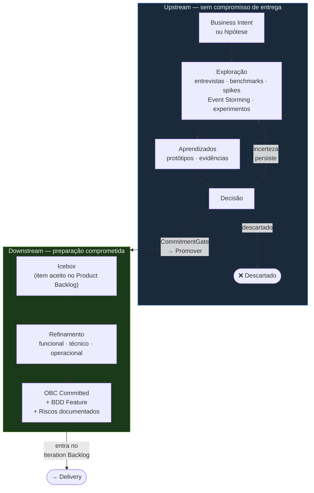

# Discovery



## Propósito

Discovery é a jornada de exploração e preparação do ProdOps. Ela existe nos modos Upstream e Downstream com responsabilidades diferentes; não é sinônimo de Upstream.

---

## Discovery no Upstream

**Objetivo:** Explorar.

Não existe obrigação de concluir artefatos. Não existem gates obrigatórios. O engenheiro decide quais Skills utilizar. O resultado esperado é aprendizado.

Pode incluir:

- entrevistas e benchmarks
- Event Storming
- protótipos e spikes
- experimentos e vibecoding
- pesquisas

Um experimento Upstream pode produzir código de qualidade de produção. O rótulo exploratório descreve o modelo de compromisso — sem gates obrigatórios, sem OBC Committed, sem Release Trail — não o limite de implantação. Por decisão explícita do time e da liderança, esse código pode ser implantado em produção ou em ambientes produtivos controlados sem exigir promoção formal para Downstream. O CommitmentGate formaliza a transição de modo; não é pré-condição de implantação.

---

## Discovery no Downstream

**Objetivo:** Preparar um item comprometido para Delivery.

Um item entra no Icebox após ser aceito no Product Backlog. A Discovery no Downstream ocorre dentro do Icebox. O objetivo é produzir um Local OBC no estado Committed por meio de refinamento:

- funcional — o que o sistema deve fazer
- técnico — como o sistema deve fazer
- operacional — como o sistema deve se comportar em produção

Ao final da Discovery no Downstream, o item possui Local OBC no estado Committed e avança para o Iteration Backlog.

---

## Objetivos gerais

O Discovery existe para:

- compreender problemas de negócio;
- validar abordagens técnicas;
- explorar capabilities de provedores;
- prototipar integrações;
- validar fluxos de negócio;
- reduzir riscos de implementação;
- evoluir o conhecimento de Produto.

---

# Repository Scope Gate

Antes de criar um experimento, BDD Feature, OBC, protótipo, mudança no Validation Workbench
ou qualquer artefato de execução, confirmar que a capability pode ser desenvolvida
ou validada dentro deste repositório.

Criar artefatos de execução apenas quando este repositório for dono ou puder exercitar diretamente
ao menos um dos seguintes:

- comportamento de API;
- lógica de domínio;
- integração com provedor;
- tratamento de webhook;
- persistência;
- contratos de propriedade da Payments API;
- fluxo do Validation Workbench;
- testes ou evidências executáveis.

Se a solicitação depende de implementação de propriedade de outro repositório ou sistema,
não criar Feature, experimento, protótipo ou artefato de execução aqui.
Registrar apenas como:

- dependência externa;
- risco de release;
- item da Product Tracking List;
- nota do Reliability Plan;
- evidência requerida do sistema responsável.

Exemplos de trabalho fora do repositório:

- implementação da Feature Flag do Checkout;
- targeting de rollout do Checkout;
- comportamento de entrega do Notification Service;
- comportamento de fulfillment do Order Management;
- integração corporativa de ITSM fora da Payments API.

O Upstream pode documentar a dependência, mas não deve fazê-la parecer executável neste repositório.

---

# Saídas Típicas

## No modo Upstream

Uma atividade exploratória (modo Upstream) pode produzir:

- código executável;
- melhorias no Validation Workbench;
- protótipos;
- cenários BDD;
- OBC drafts;
- atualizações de OpenAPI;
- atualizações de AsyncAPI;
- atualizações de Event Storming;
- atualizações do Reliability Plan;
- atualizações da Product Tracking List;
- decisões de arquitetura.

## No modo Downstream

Uma atividade de refinamento (Discovery em modo Downstream) tipicamente produz:

- OBC em estado Committed;
- BDD Feature refinada e movida para `prodops/artifacts/bdd/`;
- Riscos documentados em `prodops/artifacts/risks/risks.md`;
- Reliability Plan atualizado (quando aplicável);
- entrada no Iteration Plan com status `Entrou`.

---

# Workflow

## Fluxo Upstream

Um fluxo Upstream típico é:

Pergunta de Negócio

↓

Hipótese

↓

Experimento

↓

Implementação

↓

Validação Funcional

↓

Aprendizado

↓

Decisão

↓

CommitmentGate

↓

Downstream (se Promover)

## Fluxo Downstream

Quando a jornada Discovery opera em modo Downstream (refinamento de item comprometido):

Item aceito no Product Backlog

↓

Icebox (refinamento funcional, técnico, operacional)

↓

OBC Committed + BDD Feature + Riscos documentados

↓

Readiness Gate aprovado

↓

Iteration Backlog → Delivery

---

# Experiments

Experimentos ficam em:

```
prodops/artifacts/experiments/
```

Cada experimento deve responder a uma pergunta específica.

Exemplos:

- A API do provedor é suficiente?
- Qual arquitetura deve ser adotada?
- Este fluxo de negócio pode ser validado?
- Quais são os riscos operacionais?

Experimentos devem ser pequenos e focados.

Um experimento pode ser transversal (envolver múltiplos produtos), desde que um produto primário seja declarado como responsável pelo experimento.

## Condições para abrir um experimento formal

Todas as quatro condições devem ser verdadeiras:

1. **Hipótese falsificável** — é possível definir o que invalidaria a hipótese
2. **Hipótese não respondida** — a resposta não existe nas evidências já disponíveis
3. **Resposta tem valor de decisão** — afeta o que será construído ou como será construído
4. **Custo de ignorar > custo de experimentar** — o custo de assumir a hipótese como verdadeira sem testar é maior que o custo do experimento

Se qualquer condição falhar, o experimento pode não ser o instrumento correto: pode ser uma pesquisa rápida, uma decisão de negócio direta, ou trabalho que já cabe em Downstream.

## Experiment File Layout

Novos experimentos devem usar um diretório por experimento:

```text
prodops/artifacts/experiments/NNN-short-slug/
  experiment.md
  upstream-trail.md
  evidence/
```

Use `experiment.md` para a hipótese estável, escopo, descobertas, recomendação e Decision Package.

Use o `upstream-trail.md` local do experimento para notas cronológicas de execução, evidências de validação, mudanças em artefatos e decisões ocorridas durante o experimento.

Use `evidence/` apenas para material de suporte muito detalhado para o documento do experimento, como saídas de comandos, capturas de tela, exemplos de payload ou respostas do provedor.

Arquivos planos de experimento restaurados de caminhos legados são artefatos históricos. Não criar novos arquivos planos de experimento. Se um arquivo plano for restaurado do histórico ou de outra branch, migrá-lo para o padrão de diretório canônico antes de fazer outras alterações.

O `prodops/framework/journeys/discovery/upstream-trail.md` global não é o lugar primário para o histórico de execução de experimentos. Mantê-lo como índice cronológico de alto nível para marcos entre experimentos, migrações, promoções e mudanças de processo na jornada Discovery ou no modo Upstream em nível de repositório.

---

# Validation Workbench

O Validation Workbench é o ambiente preferencial para validação funcional.

É usado para:

- validar fluxos de negócio;
- validar integrações;
- validar cenários BDD;
- simular comportamento do provedor;
- validar UX;
- reduzir incerteza de implementação.

O Validation Workbench é usado na jornada Discovery operando em modo Upstream.

---

# CommitmentGate — Transição Upstream → Downstream

O CommitmentGate é o gate formal de transição entre Upstream e Downstream.
Ele não ocorre automaticamente ao final de um experimento — o trio deve ser convocado explicitamente.

## Pré-condições para convocar o CommitmentGate

Antes de convocar, confirmar que todas as quatro condições são verdadeiras:

1. **Hipótese respondida** — os Exit Criteria do experimento foram satisfeitos; o Decision Package está completo.
2. **Evidence Threshold satisfeito** (se declarado) — o critério de suficiência de evidência registrado no `experiment.md` foi atingido.
3. **OBC Draft existe** — ao menos o arquivo, com nome da capability e referência ao experimento.
4. **BDD draft legível** — rascunho dos cenários de comportamento esperado (não precisa estar em `prodops/artifacts/bdd/`).

**Critério de verificabilidade:** um membro do trio que não participou do experimento deve conseguir ler o Decision Package e chegar às mesmas conclusões sem contexto verbal adicional. Se o Decision Package requer explicação oral para ser compreendido, ele não está pronto para o CommitmentGate.

Qualquer membro do trio (PM, Tech Lead, Autor) pode convocar o CommitmentGate.

## Trio do CommitmentGate

| Papel | Responsabilidade |
|---|---|
| Product Manager | Valida o valor de negócio e decide se a capability entra no Iteration Plan |
| Tech Lead | Valida viabilidade técnica, riscos arquiteturais e OBC |
| Autor do experimento | Apresenta as descobertas e defende a recomendação |

A aprovação é coletiva. Qualquer membro pode bloquear com justificativa registrada.

## O que é avaliado

O Decision Package completo (seções do `experiment.md`):
- **Executive Summary** — entendimento compartilhado do que foi descoberto
- **Decisão Recomendada** — a recomendação do autor (ver outcomes abaixo)
- **Riscos Atualizados** — novos riscos ou riscos mitigados
- **Oportunidades Atualizadas** — oportunidades identificadas
- **Itens de Tracking Atualizados** — itens que precisam entrar nas Product Tracking Lists ou Portfolio Tracking Lists
- **OBCs Atualizados** — critérios de sucesso propostos
- **Escopo Downstream Recomendado** — o que entra na próxima iteração, se aprovado

## Outcomes Canônicos

| Outcome | O que acontece |
|---|---|
| **Promover** | Iniciar processo de promoção (ver seção "Processo de promoção para Downstream"). BDD Feature + OBC movidos. Capability entra no Iteration Plan. |
| **Promover com restrição** | Subconjunto da capability é promovido. Partes restritas permanecem em Upstream para outro experimento. |
| **Requer outro experimento** | Criar novo experimento com hipótese mais específica. Registrar a decisão no `upstream-trail.md` do experimento atual. |
| **Aguardar decisão de negócio** | Bloquear o experimento na Product Tracking List com o decisor e a data esperada. Não abrir novo experimento até a decisão chegar. |
| **Aguardar dependência externa** | Registrar a dependência no Reliability Plan e na Product Tracking List. Monitorar no Continuous Assessment. |
| **Descartar** | Registrar o aprendizado em `prodops/framework/journeys/discovery/learnings.md`. Fechar o experimento com justificativa no `upstream-trail.md`. |

## Registro do CommitmentGate

Independente do outcome, registrar no `upstream-trail.md` do experimento:
- Data do CommitmentGate
- Participantes (trio)
- Outcome canônico
- Próximos passos

Se o outcome gerar mudança no Reliability Plan, atualizar `prodops/artifacts/risks/risks.md` ou `opportunities.md` antes de fechar o ciclo.

---

# Relationship with Downstream

O Upstream opera sem compromisso de capability: o time aprende, experimenta e implanta sem OBC Committed, sem Release Trail, sem gates obrigatórios.

O Downstream opera com compromisso formal: entrega, qualidade, confiabilidade e rastreabilidade são obrigatórios em cada fase.

Uma capability deve avançar para Downstream apenas quando:

- o comportamento de negócio está compreendido;
- a arquitetura está estável;
- o Reliability Plan foi atualizado;
- o OBC está suficientemente definido;
- a incerteza remanescente é aceitável.

## Processo de promoção para Downstream

A promoção é uma decisão explícita, não uma consequência automática de um experimento concluído.

### Quem decide

A decisão de promover é do Product Manager + Tech Lead responsáveis pela capability, com base no Decision Package produzido pelo experimento.

### Critérios de promoção (CommitmentGate)

Para o CommitmentGate emitir outcome **Promover**, confirmar que:

1. O Decision Package do experimento tem recomendação clara (`Promover` ou `Promover com restrição`).
2. O BDD draft está legível em `prodops/artifacts/experiments/<NNN-slug>/features/` (rascunho dos cenários — não precisa estar completo).
3. O OBC Draft existe em `prodops/artifacts/experiments/<NNN-slug>/obcs/` (ao menos arquivo com nome e referência ao experimento — campos detalhados são preenchidos no Icebox).
4. O Reliability Plan foi atualizado com os riscos identificados no experimento.
5. A incerteza remanescente é aceitável para entrar em Downstream com compromisso de entrega.

### Passos da promoção

```
1. Mover BDD Feature:
   prodops/artifacts/experiments/<NNN-slug>/features/<slug>.feature
   → prodops/artifacts/bdd/<slug>.feature

2. Mover OBC:
   prodops/artifacts/experiments/<NNN-slug>/obcs/<slug>.md
   → prodops/artifacts/obcs/<slug>.md
   (remover marcação de draft)

3. Criar ou atualizar entrada no Iteration Plan:
   prodops/artifacts/plans/iteration-plan.md
   (adicionar com decisão `Entrou` na tabela "Iteration Plan recomendado" —
   não apenas em "Iteration Backlog identificado", pois esta seção não satisfaz
   a pré-condição formal do Downstream)

4. Atualizar Product Tracking List se o item estava lá:
   prodops/artifacts/product/backlogs/tracking-list.md
   (mudar status para "Promovido para Downstream")

5. Registrar a promoção no upstream-trail do experimento:
   prodops/artifacts/experiments/<NNN-slug>/upstream-trail.md

6. Registrar no global upstream trail:
   prodops/framework/journeys/discovery/upstream-trail.md
   (entrada de alto nível: o quê foi promovido e quando)
```

### O que NÃO é promoção de capability

- **Mover código para produção sem mover os artefatos ProdOps** — isso é "Produção Controlada" (ato permitido no Upstream, sem CommitmentGate), não promoção de capability. O código chega a produção; a capability permanece em modo Upstream.
- Criar um OBC committed sem BDD Feature correspondente.
- Iniciar implementação Downstream antes de o OBC estar em `prodops/artifacts/obcs/`.
- Promover com recomendação `Não promover` ou `Requer outro experimento` no Decision Package.

> **Distinção crítica:** "código em produção" e "capability promovida" são dois objetos diferentes. O CommitmentGate decide sobre a *capability* (compromisso de entrega formal). A decisão de implantar código é do time/liderança e pode acontecer antes, depois ou independentemente do CommitmentGate.

---

# Golden Rules

- Manter experimentos focados.
- Formular uma hipótese central por experimento; múltiplas perguntas de investigação são permitidas.
- Produzir evidências executáveis sempre que possível.
- Parar quando a hipótese tiver sido respondida.
- Atualizar os artefatos ProdOps afetados.
- Documentar aprendizados.
- Produzir uma recomendação clara com outcome canônico.
- Evitar implementar capabilities não relacionadas.

O aprendizado é o resultado primário.

A implementação é um meio para alcançar o aprendizado.


---

→ **Próximo:** [Jornada Delivery](../delivery/README.md)
