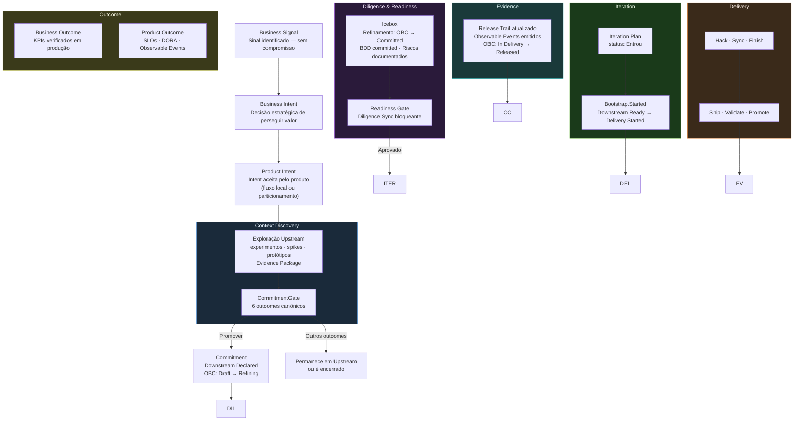

[Português](lifecycle.md)

# ProdOps Lifecycle

The canonical lifecycle of a product intent in the ProdOps Framework.

This document defines the **lifecycle stages** — distinct from the Phases of the structural model (Bootstrap, Hack, etc.). A lifecycle stage describes the point in the lifecycle where an intent currently sits; a Phase describes an execution step within a journey.

→ For the full flow with artifacts and decisions, see [`flow.md`](flow.md).
→ For structural concepts (Journey, Cycle, Phase), see [`ontology.md`](ontology.md).
→ For the canonical definitions of the terms below, see [`glossary.md`](glossary.md).

---

## Canonical lifecycle diagram

---

## Lifecycle stages

### 1. Business Signal

**What it is:** An identified signal that warrants attention — an opportunity, problem, hypothesis, benchmark, or idea. It is not a commitment. It has no OBC. It may or may not produce a Business Intent.

**Entry condition:** Any collaborator, stakeholder, or process identifies a need and records it.

**Exit condition:** The signal is investigated and recognized as strategically relevant → produces a Business Intent. Or it is discarded with justification.

**Artifacts:** Entry in the Portfolio Tracking List or Product Tracking List.

---

### 2. Business Intent / Product Intent

**What it is:** The strategic decision to pursue a specific value. The Business Intent is the platform entity (BIB); the Product Intent is the product entity (Product Backlog), created by partitioning the Global OBC or via Owner Approval in the local flow.

**Entry condition:** Business Intent — Portfolio accepts the Business Signal. Product Intent — OBC Partitioning (global flow) or Owner Approval (local flow).

**Exit condition:** Product Intent accepted in the Product Backlog → enters Context Discovery (Upstream) or direct Commitment (when there is sufficient context for Direct Downstream).

**Artifacts:** Business Intent document at `prodops/artifacts/business-intents/<slug>.md`; Local OBC Draft at `prodops/artifacts/obcs/<slug>.md` (or in an experiment).

---

### 3. Context Discovery (Upstream Exploration)

**What it is:** The exploration stage before Commitment. The work is uncertainty reduction — the cost of being wrong is controllable because the commitment has not yet been made. Conducted by the Discovery journey in Upstream mode.

**This stage is optional.** When context is sufficient to commit directly — demand confirmed through independent channels, clear scope, open questions classified as refinement — the CommitmentGate can be executed immediately at the Product Backlog entry (Direct Downstream). In that case, Context Discovery occurs within the commitment, in the Discovery journey in Downstream mode.

**Entry condition:** Product Intent accepted in the Product Backlog with hypotheses to validate; or equivalently: Business Signal with sufficient context for an immediate CommitmentGate.

**Exit condition:** Complete Decision Package, Evidence Package produced, OBC Draft in place, BDD drafted → CommitmentGate convened.

**Artifacts:** `prodops/artifacts/experiments/<NNN-slug>/experiment.md`, `upstream-trail.md`, `evidence/`.

**Flow metrics:** TTE (Time to Evidence), Decision Latency, Discovery WIP. See [`dora-metrics.md`](dora-metrics.md).

---

### 4. Commitment (CommitmentGate)

**What it is:** The formal event that transforms the execution mode. The CommitmentGate is convened by the trio (PM + Tech Lead + Author) when the Decision Package is ready. With the **Promote** outcome, the Commitment is made: rigor shifts from advisory to blocking.

**Entry condition:** Verifiable Decision Package, Evidence Threshold satisfied (if declared), OBC Draft in place, BDD drafted.

**Exit condition (Promote outcome):** OBC transitions Draft → Refining; Work Item created in the Icebox; upstream-trail updated → Downstream Declared.

**Other outcomes:** Requires another experiment, Awaiting business decision, Awaiting external dependency, Discard — all keep the item in Upstream or close the experiment.

**Mandatory record:** date, participants, canonical outcome, next steps in `upstream-trail.md`.

---

### 5. Diligence & Readiness (Icebox + Readiness Gate)

**What it is:** The refinement stage within Downstream, before Delivery. The OBC is refined from Refining to Committed. Diligence verifies, in a blocking manner, that prerequisites are satisfied before the item enters the Iteration Plan.

**Entry condition:** Downstream Declared (OBC in Refining, Work Item in Icebox).

**Exit condition:** OBC Committed, BDD Feature at `prodops/artifacts/bdd/`, risks documented, Reliability Plan (when required), Readiness Gate approved → Downstream Ready.

**The Readiness Gate is not optional:** it is the point where Diligence verifies, in a blocking manner, that the Downstream has the necessary substrate to be executed with integrity.

---

### 6. Iteration

**What it is:** The formal commitment of a capability to a delivery iteration. The item enters the Iteration Plan with status `Entrou` and Bootstrap.Started is executed, opening the Delivery journey.

**Entry condition:** Downstream Ready (all Readiness gates satisfied).

**Exit condition:** Bootstrap.Started executed → OBC transitions to In Delivery → Delivery Started.

**Artifacts:** Entry in `prodops/artifacts/plans/iteration-plan.md` with status `Entrou`.

---

### 7. Delivery

**What it is:** The execution of the Delivery journey in Downstream mode — with blocking rigor at each phase. The mandatory sequence is `Bootstrap → Hack → Sync → Finish → Ship → Validate → Promote`.

**Entry condition:** Delivery Started (Bootstrap.Started recorded, OBC In Delivery).

**Exit condition:** Promote completed, Release Trail updated, OBC transitions to Released.

**Two cycles:** CI Sync (Bootstrap → Finish: synchronous local work) and CI Async (Ship → Promote: platform and pipelines).

---

### 8. Evidence

**What it is:** The verifiable record that delivery was performed in accordance with the commitment made. The Release Trail is the append-only log that documents every phase. The Observable Events emitted prove that the behavior is operating in production.

**Entry condition:** Promote completed; OBC Released.

**Exit condition:** Release Trail complete, Observable Events operating in production, evidence available for the Assessment.

**Artifacts:** `prodops/artifacts/trails/sessions/YYYY-MM-DD-<session-id>.md`, Observable Events in the runtime.

---

### 9. Outcome

**What it is:** Verification, in real operational time, that the committed result was achieved. The Outcome is not the delivery — it is the evidence-backed confirmation that the delivery produced the committed value.

**Two planes:**
- **Business Outcome:** KPIs and business metrics verified after sustained operation; verified by the Assessment with Portfolio support.
- **Product Outcome:** Verifiable technical behavior — SLOs, DORA Metrics, Observable Events; verified continuously by the Operation journey and the Async Assessment.

**Entry condition:** OBC Released with operational evidence collected over a sufficient period.

**Without a formal Outcome, the cycle is not complete.** An OBC Released without Outcome verification is an unconfirmed delivery — the system does not know whether value was produced.

---

## Summary table

| Stage | Mode | OBC State | Primary artifact | Exit gate |
|-------|------|-----------|-----------------|-----------|
| Business Signal | — | — | Entry in Tracking List | Strategic recognition |
| Business / Product Intent | — | Draft | Intent document + OBC Draft | Owner Approval / OBC Partitioning |
| Context Discovery | Upstream | Draft | Evidence Package + Decision Package | CommitmentGate |
| Commitment | Transition | Draft → Refining | updated upstream-trail | Outcome: Promote |
| Diligence & Readiness | Downstream | Refining → Committed | OBC Committed + BDD + Risks | Readiness Gate |
| Iteration | Downstream | Committed | Iteration Plan entry | Bootstrap.Started |
| Delivery | Downstream | In Delivery | Release Trail | Promote completed |
| Evidence | Downstream | Released | Release Trail complete + Observable Events | Assessment Review |
| Outcome | Downstream | Released | Business metrics + Product Outcome | Delivered value verification |

---

## Regression Protocol

When a hypothesis is invalidated during Delivery — what was committed cannot be honored as committed — the Downstream → Upstream regression protocol is triggered:

1. Record the reason for suspension in the Release Trail
2. Open a new Upstream experiment referencing the OBC and the suspended Downstream
3. OBC transitions `Committed → Refining` (with date and justification)
4. Work Item returns to the Icebox; Downstream Declared remains as history

Regression is not a process failure — it is the correct protocol when evidence changes during execution.

→ See [`execution-model/downstream.md`](execution-model/downstream.md#protocolo-de-regressão-downstream--upstream)

---

→ **Next:** [Foundational Principles](principles.en.md)
