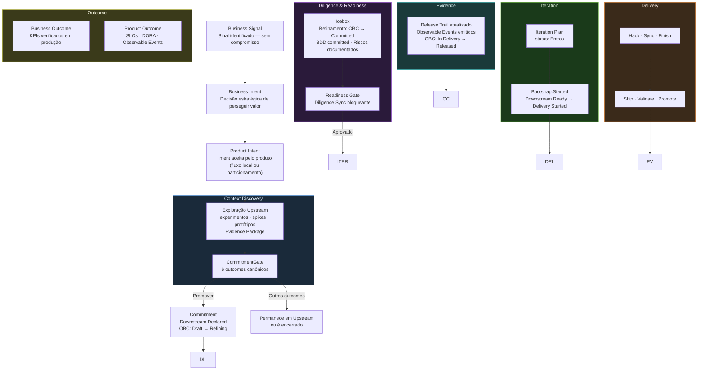

[English](lifecycle.en.md)

# ProdOps Lifecycle

O ciclo de vida canônico de uma intenção de produto no Framework ProdOps.

Este documento define os **estágios de lifecycle** — distintos das Phases do modelo estrutural (Bootstrap, Hack, etc.). Um estágio de lifecycle descreve em que momento do ciclo de vida uma intenção se encontra; uma Phase descreve uma etapa de execução dentro de uma jornada.

→ Para o fluxo completo com artefatos e decisões, ver [`flow.md`](flow.md).
→ Para os conceitos estruturais (Journey, Cycle, Phase), ver [`ontology.md`](ontology.md).
→ Para as definições canônicas dos termos abaixo, ver [`glossary.md`](glossary.md).

---

## Diagrama do lifecycle canônico

---

## Estágios do lifecycle

### 1. Business Signal

**O que é:** Um sinal identificado que merece atenção — uma oportunidade, problema, hipótese, benchmark ou ideia. Não é um compromisso. Não tem OBC. Pode ou não gerar uma Business Intent.

**Condição de entrada:** Qualquer colaborador, stakeholder ou processo identifica uma necessidade e a registra.

**Condição de saída:** O sinal é investigado e reconhecido como estrategicamente relevante → gera Business Intent. Ou é descartado com justificativa.

**Artefatos:** Registro na Portfolio Tracking List ou Product Tracking List.

---

### 2. Business Intent / Product Intent

**O que é:** A decisão estratégica de perseguir um valor específico. A Business Intent é a entidade de plataforma (BIB); a Product Intent é a entidade de produto (Product Backlog), criada por particionamento do Global OBC ou por Owner Approval no fluxo local.

**Condição de entrada:** Business Intent — Portfolio aceita o Business Signal. Product Intent — OBC Partitioning (fluxo global) ou Owner Approval (fluxo local).

**Condição de saída:** Product Intent aceita no Product Backlog → entra em Context Discovery (Upstream) ou em Commitment direto (quando há contexto suficiente para Downstream Direto).

**Artefatos:** Documento de Business Intent em `prodops/artifacts/business-intents/<slug>.md`; Local OBC Draft em `prodops/artifacts/obcs/<slug>.md` (ou em experimento).

---

### 3. Context Discovery (Exploração Upstream)

**O que é:** O estágio de exploração antes do Commitment. O trabalho é de redução de incerteza — o custo de estar errado é controlável porque o compromisso não foi assumido. Conduzido pela jornada Discovery em modo Upstream.

**Este estágio é opcional.** Quando o contexto for suficiente para comprometer diretamente — demanda confirmada por canais independentes, escopo claro, questões abertas classificadas como refinamento — o CommitmentGate pode ser executado imediatamente na entrada do Product Backlog (Downstream Direto). Nesse caso, o Context Discovery ocorre dentro do compromisso, na jornada Discovery em modo Downstream.

**Condição de entrada:** Product Intent aceita no Product Backlog com hipóteses a validar; ou equivalentemente: Business Signal com contexto suficiente para CommitmentGate imediato.

**Condição de saída:** Decision Package completo, Evidence Package produzido, OBC Draft existente, BDD rascunhada → CommitmentGate convocado.

**Artefatos:** `prodops/artifacts/experiments/<NNN-slug>/experiment.md`, `upstream-trail.md`, `evidence/`.

**Métricas de fluxo:** TTE (Time to Evidence), Decision Latency, Discovery WIP. Ver [`dora-metrics.md`](dora-metrics.md).

---

### 4. Commitment (CommitmentGate)

**O que é:** O evento formal que transforma o modo de execução. O CommitmentGate é convocado pelo trio (PM + Tech Lead + Autor) quando o Decision Package está pronto. Com outcome **Promover**, o Commitment é assumido: o rigor muda de advisory para bloqueante.

**Condição de entrada:** Decision Package verificável, Evidence Threshold satisfeito (se declarado), OBC Draft existente, BDD rascunhada.

**Condição de saída (outcome Promover):** OBC transita Draft → Refining; Work Item criado no Icebox; upstream-trail atualizado → Downstream Declared.

**Outros outcomes:** Requer outro experimento, Aguardar decisão de negócio, Aguardar dependência externa, Descartar — todos mantêm o item em Upstream ou encerram o experimento.

**Registro obrigatório:** data, participantes, outcome canônico, próximos passos no `upstream-trail.md`.

---

### 5. Diligence & Readiness (Icebox + Readiness Gate)

**O que é:** O estágio de refinamento dentro do Downstream, antes da Delivery. O OBC é refinado de Refining para Committed. A Diligence verifica, de forma bloqueante, que os pré-requisitos estão satisfeitos antes de entrar no Iteration Plan.

**Condição de entrada:** Downstream Declared (OBC em Refining, Work Item no Icebox).

**Condição de saída:** OBC Committed, BDD Feature em `prodops/artifacts/bdd/`, riscos documentados, Reliability Plan (quando obrigatório), Readiness Gate aprovado → Downstream Ready.

**O Readiness Gate não é opcional:** é o ponto onde a Diligence verifica, de forma bloqueante, que o Downstream tem o substrato necessário para ser executado com integridade.

---

### 6. Iteration

**O que é:** O comprometimento formal da capability em uma iteração de entrega. O item entra no Iteration Plan com status `Entrou` e Bootstrap.Started é executado, abrindo a jornada Delivery.

**Condição de entrada:** Downstream Ready (todos os gates de Readiness satisfeitos).

**Condição de saída:** Bootstrap.Started executado → OBC transita para In Delivery → Delivery Started.

**Artefatos:** Entrada em `prodops/artifacts/plans/iteration-plan.md` com status `Entrou`.

---

### 7. Delivery

**O que é:** A execução da jornada Delivery em modo Downstream — com rigor bloqueante em cada fase. A sequência obrigatória é `Bootstrap → Hack → Sync → Finish → Ship → Validate → Promote`.

**Condição de entrada:** Delivery Started (Bootstrap.Started registrado, OBC In Delivery).

**Condição de saída:** Promote concluído, Release Trail atualizado, OBC transita para Released.

**Dois ciclos:** CI Sync (Bootstrap → Finish: trabalho local síncrono) e CI Async (Ship → Promote: plataforma e pipelines).

---

### 8. Evidence

**O que é:** O registro verificável de que a entrega foi realizada conforme o compromisso assumido. O Release Trail é o log append-only que documenta cada fase. Os Observable Events emitidos provam que o comportamento está operando em produção.

**Condição de entrada:** Promote concluído; OBC Released.

**Condição de saída:** Release Trail completo, Observable Events operando em produção, evidência disponível para o Assessment.

**Artefatos:** `prodops/artifacts/trails/sessions/YYYY-MM-DD-<session-id>.md`, Observable Events no runtime.

---

### 9. Outcome

**O que é:** A verificação, em tempo operacional real, de que o resultado comprometido foi alcançado. O Outcome não é a entrega — é a confirmação com evidência de que a entrega produziu o valor comprometido.

**Dois planos:**
- **Business Outcome:** KPIs e métricas de negócio verificados após operação continuada; verificado pelo Assessment com suporte do Portfolio.
- **Product Outcome:** Comportamento técnico verificável — SLOs, DORA Metrics, Observable Events; verificado continuamente pela jornada Operation e pelo Assessment Async.

**Condição de entrada:** OBC Released com evidência operacional coletada por período suficiente.

**Sem Outcome formal, o ciclo não está completo.** Um OBC Released sem verificação de Outcome é uma entrega não confirmada — o sistema não sabe se o valor foi produzido.

---

## Tabela de resumo

| Estágio | Modo | OBC State | Artefato principal | Gate de saída |
|---------|------|-----------|-------------------|---------------|
| Business Signal | — | — | Registro na Tracking List | Reconhecimento estratégico |
| Business / Product Intent | — | Draft | Documento de Intent + OBC Draft | Owner Approval / OBC Partitioning |
| Context Discovery | Upstream | Draft | Evidence Package + Decision Package | CommitmentGate |
| Commitment | Transição | Draft → Refining | upstream-trail atualizado | Outcome: Promover |
| Diligence & Readiness | Downstream | Refining → Committed | OBC Committed + BDD + Riscos | Readiness Gate |
| Iteration | Downstream | Committed | Iteration Plan entry | Bootstrap.Started |
| Delivery | Downstream | In Delivery | Release Trail | Promote concluído |
| Evidence | Downstream | Released | Release Trail completo + Observable Events | Assessment Review |
| Outcome | Downstream | Released | Métricas de negócio + Product Outcome | Verificação de valor entregue |

---

## Protocolo de Regressão

Quando uma hipótese é invalidada durante a Delivery — o que foi comprometido não pode ser honrado como comprometido — o protocolo de regressão Downstream → Upstream é acionado:

1. Registrar no Release Trail o motivo da suspensão
2. Abrir novo experimento Upstream referenciando o OBC e o Downstream suspenso
3. OBC transita `Committed → Refining` (com data e justificativa)
4. Work Item retorna ao Icebox; Downstream Declared permanece como histórico

A regressão não é falha de processo — é o protocolo correto quando a evidência muda durante a execução.

→ Ver [`execution-model/downstream.md`](execution-model/downstream.md#protocolo-de-regressão-downstream--upstream)

---

→ **Próximo:** [Princípios Fundacionais](principles.md)
